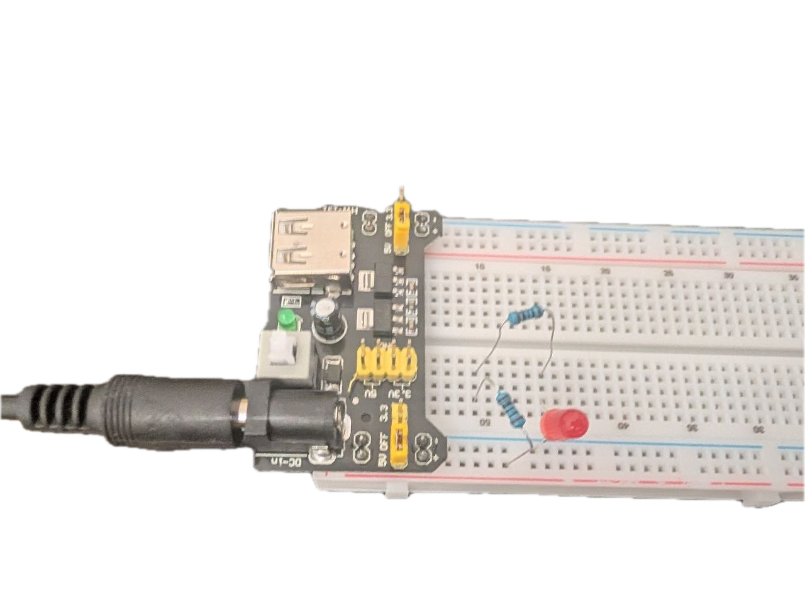
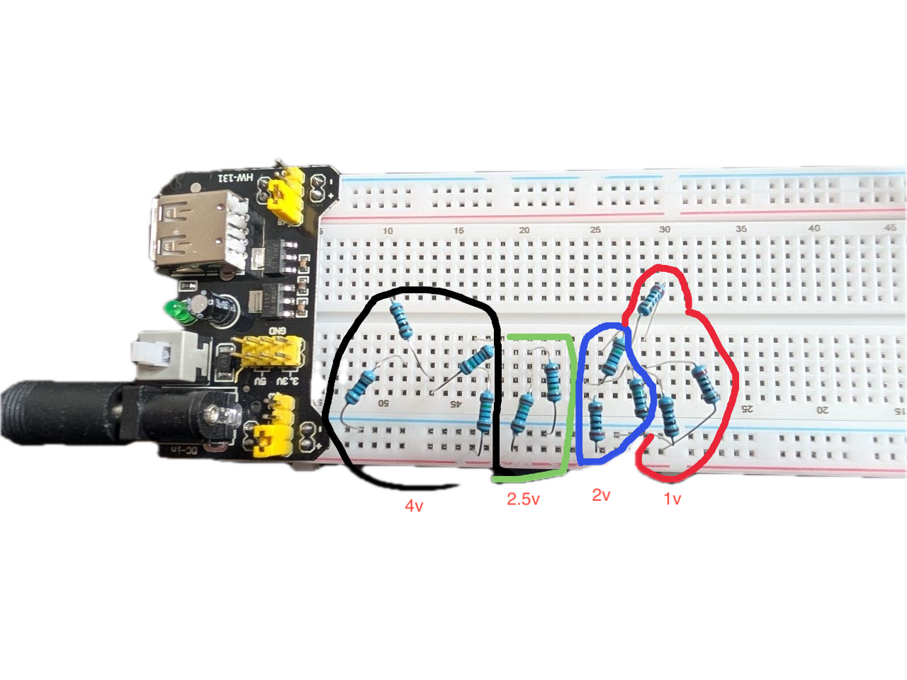

# Lab1.Завдання 1

1. джерело живлення: 5v,5A. Потрібно нам 10..15mA
2. червоний led: їсть напругу 2v та силу струму 10..30mA
3. 5v - 2v = 3v. Резистор має перетворювати 3v на тепло (//todo recall this later at winter)
4. Закон Ома: R=V/I
5. R = 3/0.015A = 200 Ohms. В реалі взяв 2 резистори 100+100ohm (був на 200 але цікаво було взяти два резистора)
6. Потужність P=Ur * I = 3 * 0.015A = 0.02W
7. Запас міцності по потужності x2 щоб не грівся: 0.02W*2 = 0.04W

|              | r1 100 ohm         | r2 200 ohm         | червоний діод |
|--------------|--------------------|--------------------|---------------|
| розрахункові | 0.015*100=**1.5V** | 0.015*100=**1.5V** | **2v**        |
| розрахункові | 1.585v             | 1.585v             | 1.829         |
| реальні      | 1.51v              | 1.51v              | 1.99          |

[falstad link](https://www.falstad.com/circuit/circuitjs.html?ctz=DwYwlgTgBAZgvAIgIwKgFwM6IAwDpsHYpRgg64Ds2AHBQKzYAsV1NATG3QGyogBGiOo1QAHAQjptUANwiDUAW0yCApgFokKAHwAoKFGAAZAKIARKAA9EjRtSgBme1yiS7jnrByKA9ogAmKjAAhgCuADZoamEqfrxyyLwA5l5Q-CkKfGQIeEQIAPS6+sCJloj21IwOTg6SUIxIHvDZ+YUG0qUSbHYN2A4VUD2oTQ2oAO5N2IpBFtLyBXoGox2uA1y9K+5DXvNFS1YI5ZXuDmy9m57NOwbQ+4erZ-3nE6jxSI4tC8B7Zf09J71sRiTC6TK7AEQdeynKCAs7Qp5lRQqFIYLLAiDI5CEbEfIoAQQUChUaBUNx+R2qNjcTi2ByRKLRuIMENu-SB6y6dQItPs9OaUFRKQxiCQ2MITK+kMe1Tu7NpoNakv2G2qKzlII+wDy4AguiAA)



# Lab1.Завдання 2

Скласти схему в симуляції Falstad або з наявних компонентів електричну схему подільника напруги для отримання від джерела живлення 5 В таких напруг:
1. 1V
2. 2V
3. 2.5V
4. 4V

   Формула напруги подільника напруг: 2 резистори послідовно, вузол Vout - між ними.
   Vout = Vin * R2/(R1+R2)
   припустим що в нас є елемент котрий живиться 15mA.
   Ми можемо спробувати розрахувати всі 4 кейси на одній схемі:
```
4v=5vin*R2/(R1+R2)
4/5=R2/(R1+R2)
0.8=R2/(R1+R2)
0.8*R1 + 0.8*R2 = R2
0.8*R1 = 0.2*R2
4*R1=R2

Реальна схема
R1=100 Ohm, R2= 2*150 Ohm + 100 Ohm
Вимірянізначення Vr1=4V, Vr2=1V

Потужність:
1.Загальна сила струму I=5v/ 100+400 Ohm = 0.001A
2. P= I^2*R
3. P1= 0.001A*0.001A*100 = 0.0001 W
4. P2= 0.001A*0.001A*400 = 0.0004 W

```

```
2.5v=5vin*R2/(R1+R2)
2.5/5=R2/(R1+R2)
0.5=R2/(R1+R2)
0.5*R1+0.5*R2 = R2
R1 + R2 = 2*R2
R1 = 2*R2 - R2
R1 = R2

Реальна схема
R1=150 Ohm, R2= 150 Ohm
Vr1=2.5V, Vr2=2.5V

Потужність:
1.Загальна сила струму I=5v/ 150+150 Ohm = 0.01(6)A
2. P1=P2= 0.0002(7)*150 = 0.041(6) W
```

```
2v=5vin*R2/(R1+R2)
2/5=R2/(R1+R2)
0.4=R2/(R1+R2)
0.4*R1+0.4*R2 = R2
4*R1 = 6*R2
2*R1= 3*R2
R1=200 Ohm, R2= 2*150 Ohm

Потужність:
1.Загальна сила струму I=5v/ 200+300 Ohm = 0.001A
2. P1= 0.001A*0.001A*200 = 0.0002 W
3. P2= 0.001A*0.001A*300 = 0.0003 W
```

```
1v=5vin*R2/(R1+R2)
1/5=R2/(R1+R2)
0.2=R2/(R1+R2)
0.2*R1+0.2*R2 = R2
0.2*R1= R2 - 0.2*R2 = 0.8*R2
R1= 4*R2

Реальна схема
R1=100 Ohm, R2= 2*200 Ohm
Vr1=1V, Vr2=4V

Потужність:
1. Загальна сила струму I=5v/ 100+400 Ohm = 0.001A
2. P1= 0.001A*0.001A*400 = 0.0004 W
3. P2= 0.001A*0.001A*100 = 0.0001 W

```
[Falstad link](https://www.falstad.com/circuit/circuitjs.html?ctz=DwYwlgTgBAZgvAIgIwKgFwM6IAwDpsHYpRgg64Ds2AHBQKzYAsV1NATG3QGyogBGiOo1QAHAQjptUANwiDUAW0yCApgFokKAHwAoKFGDSoAD0EUuUJG2pRGrS9dTxkPKAHdn2RQENj0+QD0uvrAbiaIAMzUjFBsjNhQEREWHMKwOAhBegbQpghRMUhcCQWx8U4ZUHLIBJnBBmF5pUUlyZbFFQheWSEi4fltLYltqZ0RiiqVGGRdqBCTNYSEddnAuZHRZSWbSa6ec4jx3fXAfU0j3MMWEUxjE1MzXlULSEvLPQ39u7GXpXFP+w+oS+bRuMVKu06x1WjTMFisNjo5lsESk6VmQIA8l9Nv8rltOsRphkgbCEHYEoxUVAkRYqWjAScyRDQTsuNQoSsQszNvTbPZ6ZzSTjCsVEpsEUKmf1rDYhrKHBz0dDuTLqDZvgrkkrGatsXkFXijeV0UTHlzPgb4okmLF1VcpTCZdbOCl7f9Hb1nQlXVsbWlnOMoAoFk9ibNnohXm8VTk1TYjfbIcqDosLadve0fS64ndg6HUOGnvMozHY8CDfb5daWp645W5WLDSb9lVS+Wyc3sz7cynhXkkABONhZyzDxV1itR8ffIcj7WT-XTkd4pCMGIe02F839qPr-1j+fJSdktcby5zgl9k5nPfn+H7sF5kMPSolxZvdPrZDj1cz48pm2CBsLUQK3sg+5DGesS9oG9wRkWcwvGW6anuOUGQR016rN+l5Qb+LZvpEoHSgOBEJNBozYaqeSDvCYp0RO1GWogjHfGx7KLv0jF4nYV7OGaJKkYcGq2mxAG6jRIk-BYPGERiN79Hxvp8U+6JBi+CHmpGH5LF+3EpNa4l7ERaZgUpjaUgmsGRPBYbae+0afruCCMUMfG1sxawGaOckAqZRyoT5vHWQGQlOk0ErWHacqOF5nZVtFeFxZJLE-iOCJQG5KXhVJrl0tSl6CvF-RFdSCrFalU7AfafKlJVuUGAAggoIZoCo34Quy4oxA1+R2dujXAC1bUdfGiTdRVqLPgWUCIUCI0qO1uEzt1ZUMrZ+avgpqyLctPnallBUbf1W1aUNe1jXkFKKj1TFwWd9nhcAATgBAuhAA)

