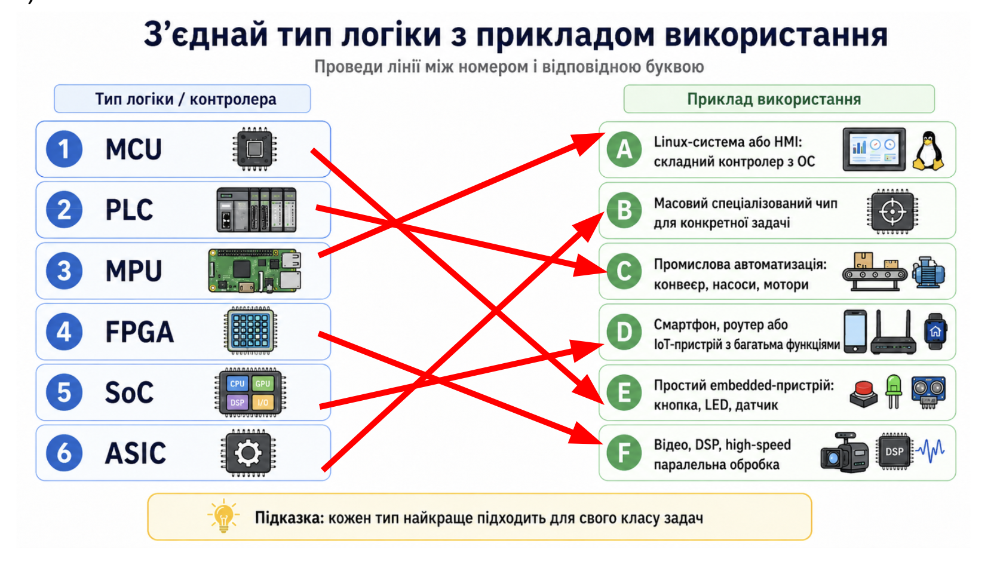
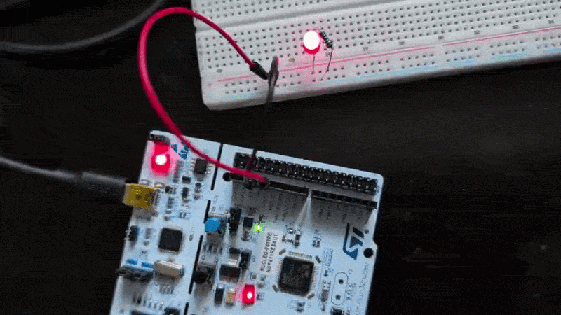
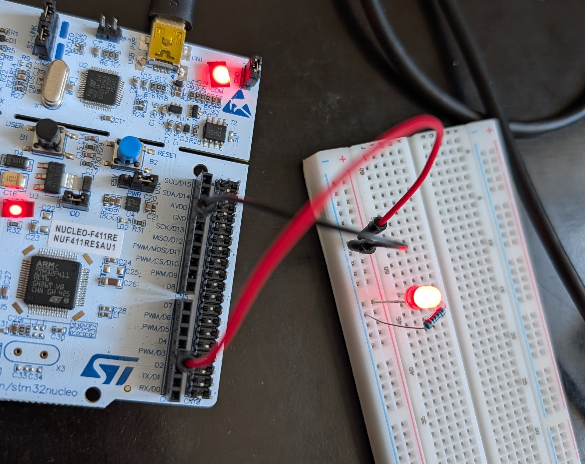
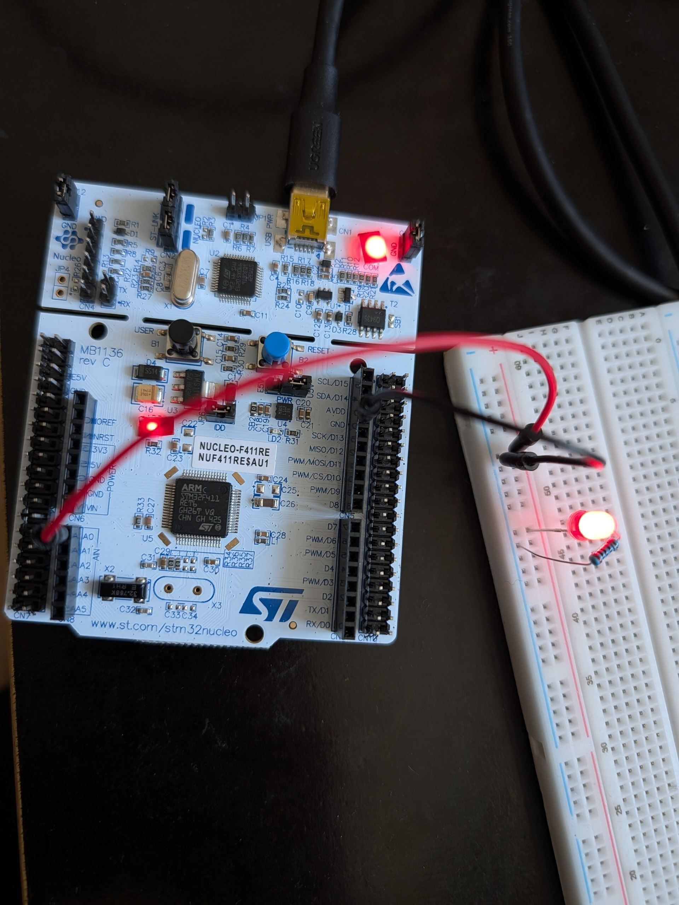
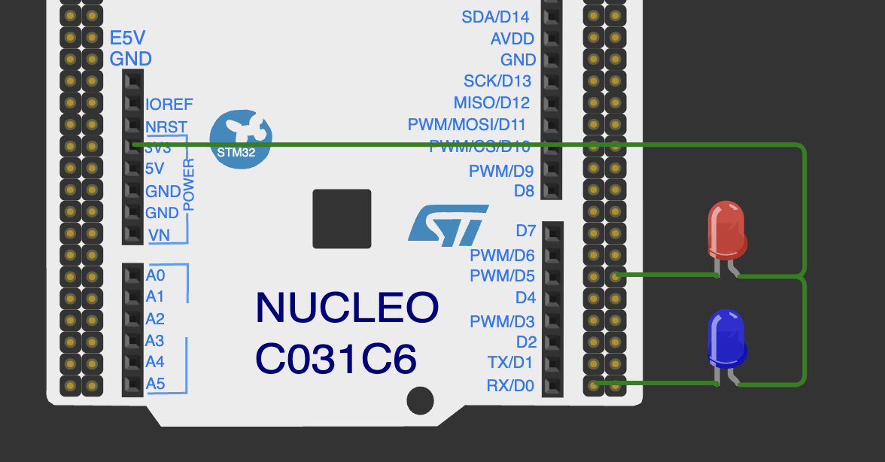
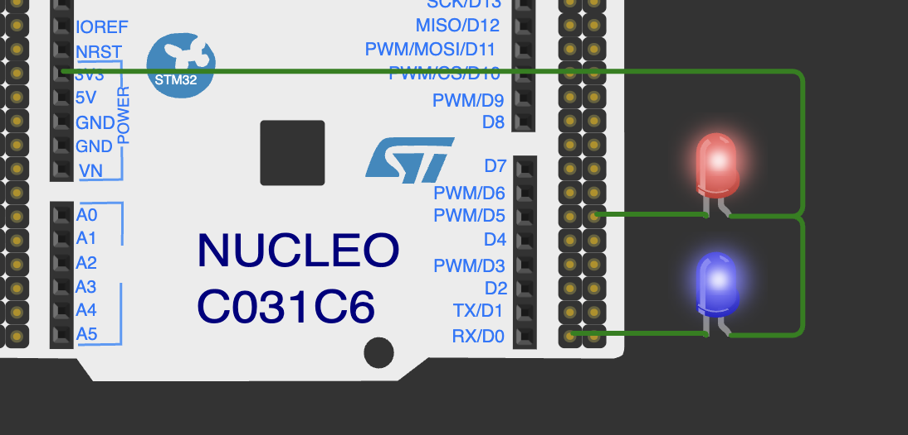
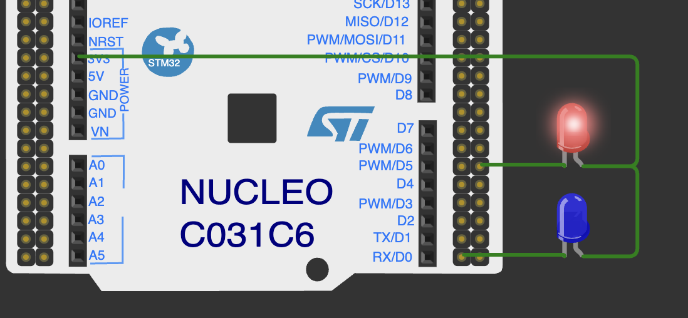
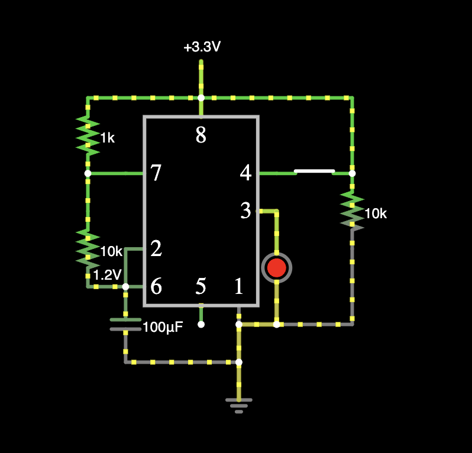

# Lab10

### Програмована логіка


#### Теорія



#### Ознайомлення з концептом розпіновки (pinout)

###### pins D13 / PA5
[sources](1.led_blink/main.cpp)




###### pin D3

```cpp
const int LED_PIN = D3;
```



###### pin A0

```cpp
const int LED_PIN = A0;
```




#### Налаштування GPIO

[link to wokwi](https://wokwi.com/projects/466896383563455489)


Поміняйте під моди в коді так, щоб: 
 1) Обидва LED-и не світилися.



```cpp
  pinMode(LED_RED, INPUT_PULLUP); 
  pinMode(LED_BLUE, INPUT_PULLUP); 
```

 2) Обидва LED-и світилися.



```cpp
  pinMode(LED_RED, INPUT_PULLDOWN); 
  pinMode(LED_BLUE, INPUT_PULLDOWN); 
```

 3) Світився червоний, а синій — ні.




```cpp
  pinMode(LED_RED, INPUT_PULLDOWN); 
  pinMode(LED_BLUE, INPUT_PULLUP); 
```


#### Порівняння логіки


Оцініть різницю між зміною роботи програмованої та не програмованої логіки.

Для програмованої логіки зміна полягає в зміні насамперед коду. Для зміни непрограмованої логіки необхідно змінювати фізично схему елементів. Наприклад для того щоб змусити led миготіти так само як в коді:

```cpp
    digitalWrite(LED_PIN, HIGH);
    delay(100);
    digitalWrite(LED_PIN, LOW);
```

потрібно було б замінити flip-flop на таймер і т.д:




[link to falstad](https://www.falstad.com/circuit/circuitjs.html?ctz=DwYwlgTgBAZgvAIgIwKgFwM6IAwDpsEECsqYIiAzABwBMuA7AGw1G1IAsFAnF9o+6hAAjRI0aoADiISdUANwiISUALaYlAUwC0SFAD4AUFCjAASlAAelGtihJGtijbtIaqeMnFQA7h+yoVAEMLOUpcCgQAekNjYABzS0oiGihqdlTkqHZ7dxwomJMAFTAVDWgrBBZGOy4UmnoUpFrc5AEoOSJEOnrqCkYuemoqLnZsLgjooxNvRJl2KigaGnT2ebsHFv9J2JmKp1t7W1WFw838qeByxGPF5ay1mioqM6hFZEItguBdpJSKTLSGTcsDy22msxujwWN3+wL85x2ELWsNSVHSsLOYMusyW6UOt3SuJebyQhARJiulTuVQJqRsxMQpLJWJAOKI1X2i3ZqLa8Kg5AQeA+PBForFPFIoUF+GwKCgGDe-naABMurgkLReNgnth5uxGLpyd9Zpz8bj1kr4ViflTCdTuUSQYKjTaaZzzfsWm5rTj7dVzY6rV9XQ6nlyOfSnZ8LjaUXGAWjMcGTQnCdy0kmLgAZACiABETWjwzygS8VAB7RDKjQwQIAVwANmgtA2NMrBCTBHE8vzpEqVEIBUKUFiMIW7SsHstM8BIuAIIYgA)


