# Lab11

### Провідні інтерфейси комунікації

| Інтерфейс | Serial / Parallel | Sync / Async | Topology       | Duplex      | Тип сигналу  | Тип виходу      | Потрібен pull-up? | Є clock? | Є адресація? |
|:----------|:------------------|:-------------|:---------------|:------------|:-------------|:----------------|:------------------|:---------|:-------------|
| GPIO      | Serial            | Asynchronous | Point-to-point | Half-duplex | Single-ended | Simplex/Depends | Опційно           | Ні       | Ні           |
| UART      | Serial            | Asynchronous | Point-to-point | Full-duplex | Single-ended | Push-pull       | Ні                | Ні       | Ні           |
| I2C       | Serial            | Synchronous  | Bus            | Half-duplex | Single-ended | Open-drain      | Так               | Так      | Так          |
| SPI       | Serial            | Synchronous  | Host-device    | Full-duplex | Single-ended | Push-pull       | Ні                | Так      | Через CS     |
| 1-Wire    | Serial            | Asynchronous | Bus            | Half-duplex | Single-ended | Open-drain      | Так               | Ні       | Так          |
| CAN       | Serial            | Asynchronous | Bus            | Half-duplex | Differential | Push-pull       | Ні                | Ні       | Через ID     |
| USB       | Serial            | Asynchronous | Bus            | Full-duplex | Differential | Push-pull       | Так               | Ні       | Так          |


### Виберіть відповідні інтерфейси для такий задач


1) датчик температури біля MCU; -- I2C, 1-WIRE (для DS18B20),
2) дисплей з високою частотою оновлення; SPI (спробую фізично нижче по лабораторній), USB*
3) зв’язок між платами на 10 метрів; CAN (як в авто), USB
4) debug-порт для прошивки; UART, ?USB?
5) мережа з 8 контролерів у шумному середовищі. Потрібно щось диференціальне - CAN, USB думаю теж

*USB підходить як відповідь майже скрізь, але USB складніший та потенційно дорожчий варіант


### Знайдіть і виправте помилку UART

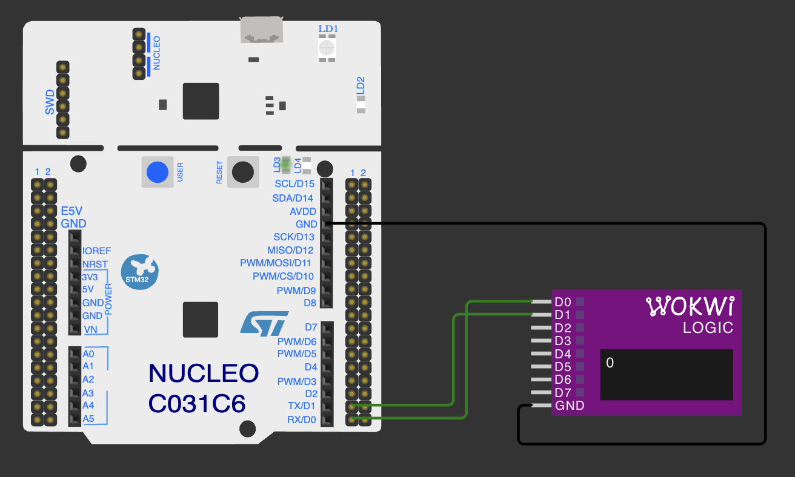
Немає семплів

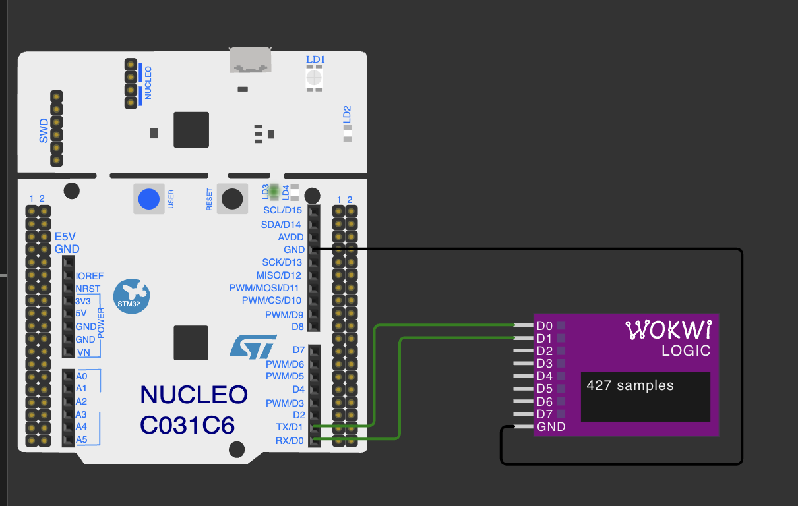
Є семпли (підключення логічного аналізатора виправлене)

Помилка в тому що в логічний аналізатор wokwi має рівно один параметр для тригеру і це атрибут triggerPin

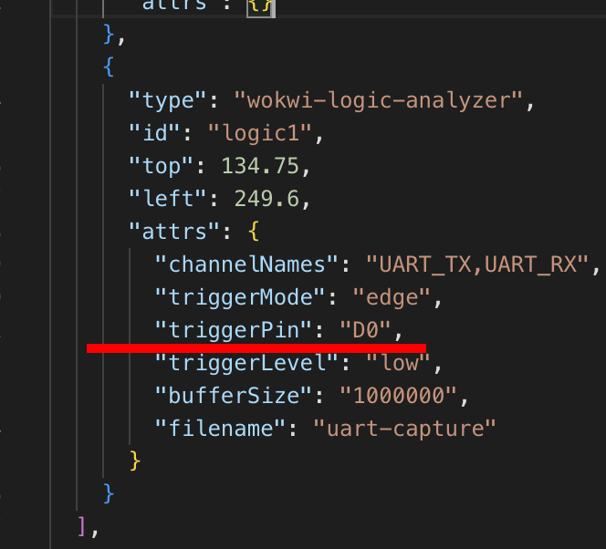

Він налаштований на D0. В схемі до D0 ЛА іде дріт від Rx піна D0 на stm32. ЛА очікує на зміну сигналу, її не відбувається, отримуємо 0 семплів.
Тобто дріт по якому stm32 чекає на дані від зовнішнього девайса (Rx) підключений до умовного Rx ЛА.


### Знайдіть і виправте помилку SPI

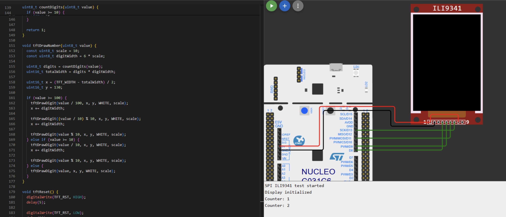

Бачимо що 2 піни не зʼєднані. Ідемо шукати pinout цього tft дисплея

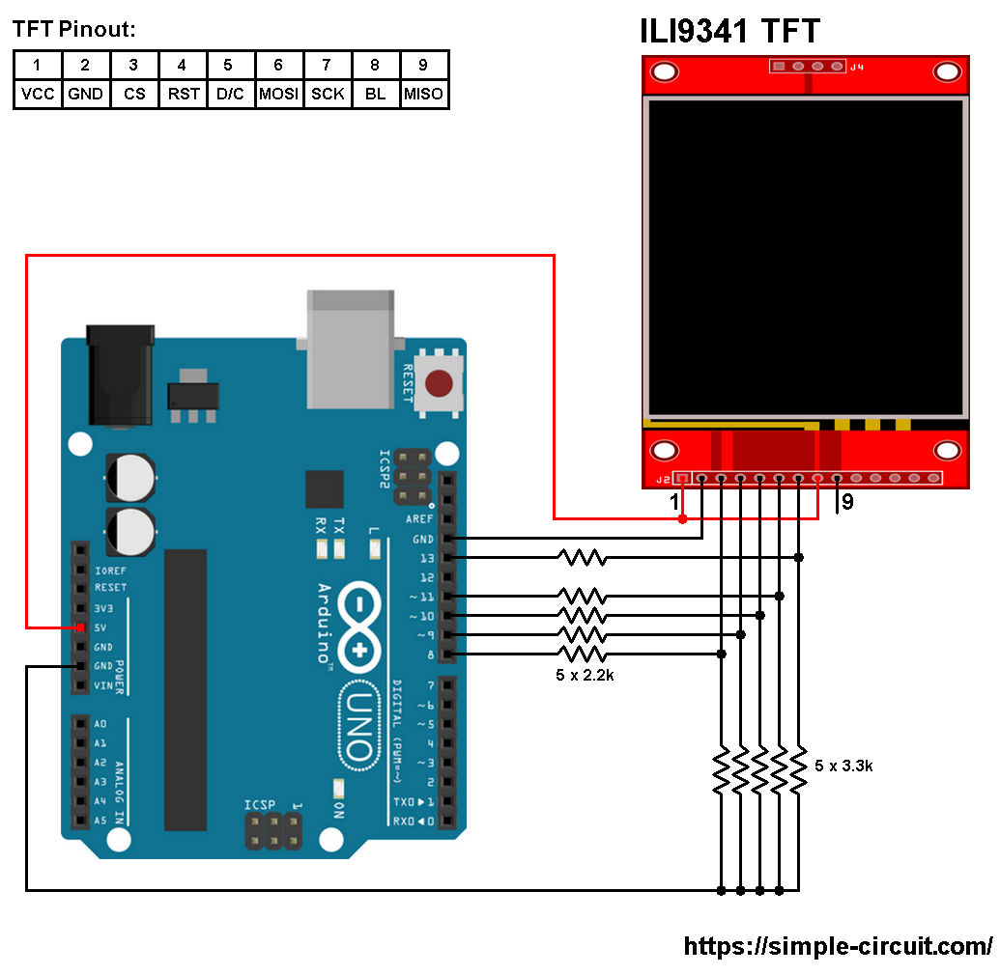

Непідключений порт 3 це CS. Chip select. Тобто дисплей не здатен почати працювати бо сигнал chip select не прийде.
Непідключений порт 9 це MISO. судячи по коду ми не очікуємо нічого від дисплея. Можна нехтувати цим піном в нашому випадку.

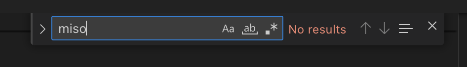


Бачимо в коді що як пін для CS обрано 10 (D10):

```cpp
#define TFT_CS   10
```

Підключаємо CS:
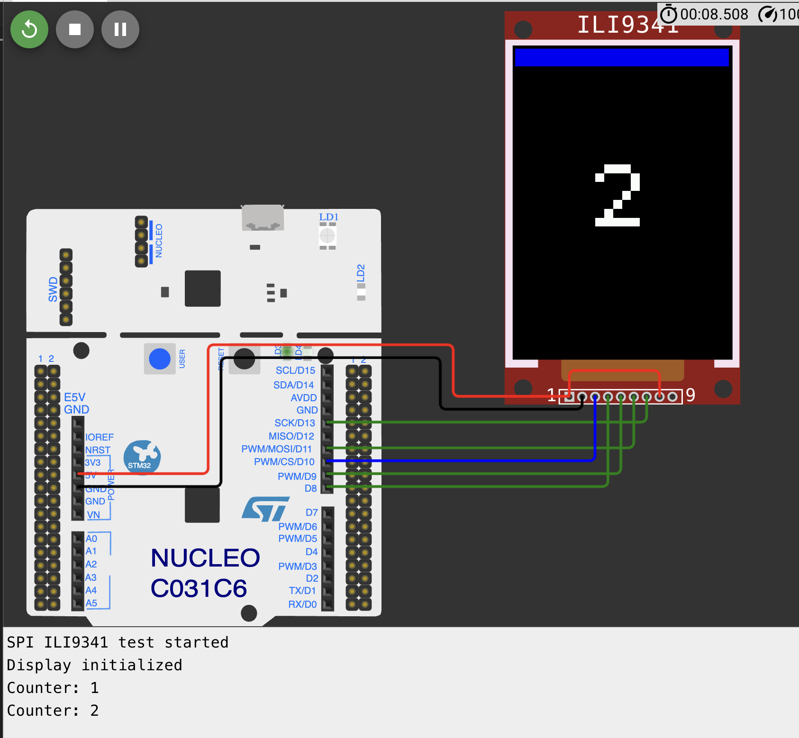

### Знайдіть і виправте помилку I2C

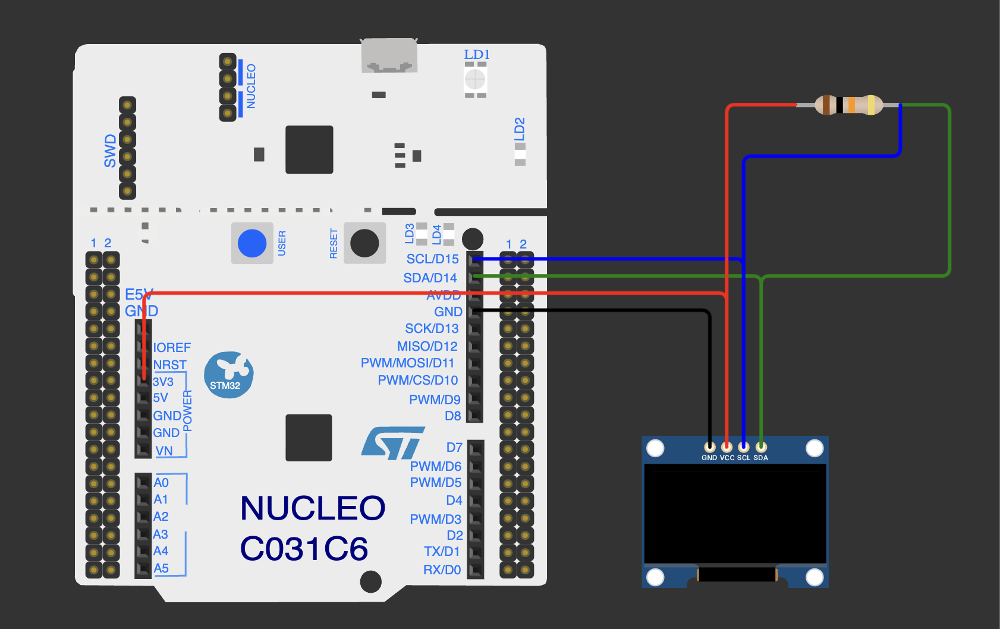

1. Судячи з коду піни підключені вірно
2. Маємо pull-up резистор
3. GNR/VCC підключені вірно
4. Адреса девайсу вірна (судячи з специфікації девайсу на wokwi wiki)
5. Все одно не робе.

Після роздумів було помічено що pull-up для SDA SLC зроблений таким чином що обидва дроти SDA та SLC фізично зʼєднані між собою. Зробимо по окремому резистору для кожного з них:

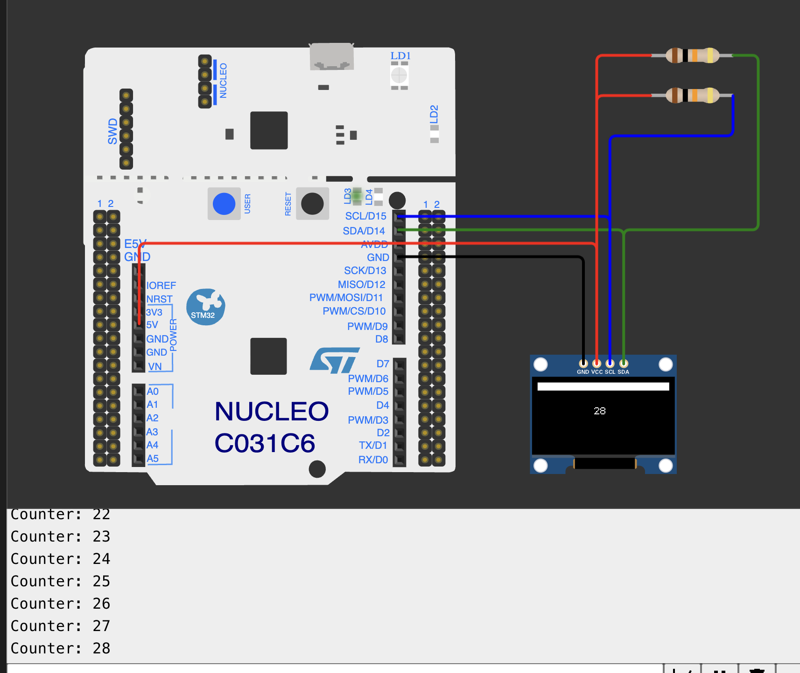


### Завдання просунутого рівня I2C Oled display SSD1306

*примітка. Були проблеми з підключенням, перебрав усі комбінації можливих помилок, спочатку використовував піни D14, D15, сусідні vcc + gnd, зробив підтяжки по резисторам окремо під кожну лінію. В результаті запрацював варіант з виділенням окремих пінів D2-D5

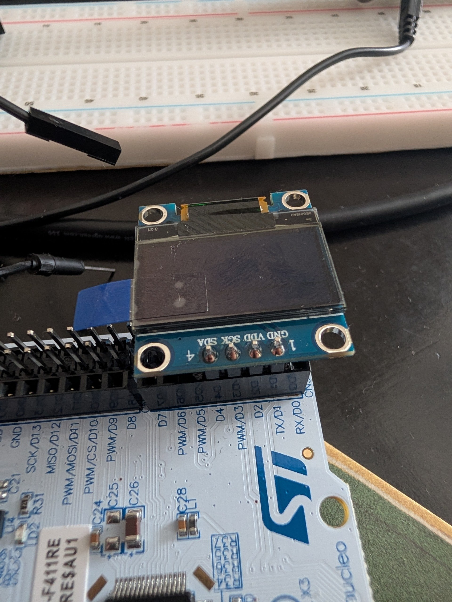

Код з бібліотекою-хелпером виводу зображень `U8g2lib` можна знайти [тут](./tft_display_other/main.cpp)

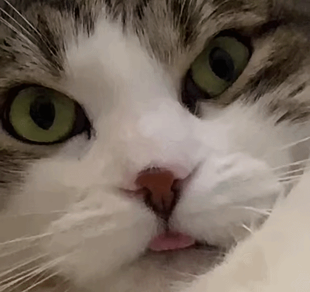

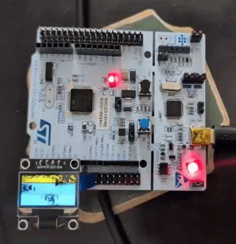


