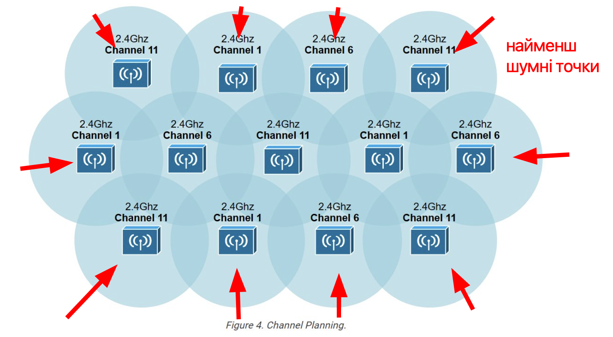
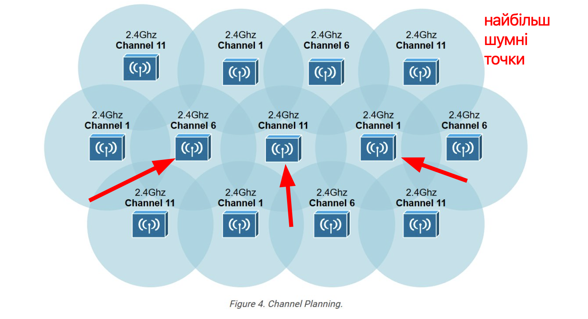

# Lab12

### Безпровідні інтерфейси комунікації

### Завдання 1: Розрахунок довжини хвилі
### Завдання 2: Розрахунок чвертьхвильового резонансу (λ/4)

```
13.56 МГц:
Довжина хвилі: 300 000 000 / 13 560 000 дорівнює приблизно 22.12 м.
Напівхвиля: 11.06 м.
Чвертьхвиля: 5.53 м.
```

```
2.4 ГГц:
Довжина хвилі: 300 000 000 / 2 400 000 000 дорівнює 0.125 м.
Напівхвиля: 0.0625 м. (6.25 см).
Чвертьхвиля: 0.03125 м. (3.125 см).
```

```
Для 5 ГГц:
Довжина хвилі: 300 000 000 / 5 000 000 000 дорівнює 0.06 м.
Напівхвиля: 0.03 м (3 см).
Чвертьхвиля: 0.015 м. (1.5 см).
```

### Завдання 3: Порівняння антенних систем

>чому NFC-антена фізично більша за Bluetooth-антену?

Bluetooth переважно працює на 2.4 GHz. Його Чвертьхвиля 3.125 см.
NFC працює на 13.56 MHz. Його Чвертьхвиля 5.53 м.

В реальності маємо для nfc довжину відмінну від 5.53м. Використовують орієнтовно метрову антену у вигляді компактно намотаних витків провідника. Таким чином nfc-антена лишається малою по площі. Це обумовлено тим що nfc заточений на близьку взаємодію (near field communication). У цьому режимі антена не випромінює радіохвилі, а працює як котушка індуктивності. Зв'язок між пристроями відбувається завдяки магнітній взаємоіндукції.

### Завдання 4: Аналіз потужності сигналу

>Відсортуйте значення сигналу за спаданням потужності:

```
0 dBm
-40 dBm
-90 dBm
```

### Завдання 4: Аналіз зашумленості середовища

Використовуючи зображення нижче, позначте точки, де середовище є найбільш шумним та найменш шумним:





### Завдання 6: Розрахунок втрат у вільному просторі (FSPL)

>Розрахуйте Free Space Path Loss (FSPL) для наступних параметрів та порівняйте результати:

FSPL = 20 * log10(d) + 20 * log10(f) + 92.45

```
2.4 GHz на відстані 100 метрів;
20 * log10(0.1) + 20 * log10(2.4) + 92.45 = 80.0542 дБ
```

```
5 GHz на відстані 50 метрів.
20 * log10(0.05) + 20 * log10(5) + 92.45 = 80.408 дБ
```

Результати майже ідентичні. Енергія на таких відстанях для таких частот втрачається однаково.


### Завдання 7: Відповідність протоколів та застосування


| Протокол          | Спосіб застосування                                  |
|:------------------|:-----------------------------------------------------|
| WIFI              | Передача відео, інтернету, великих файлів            |
| LoRa              | Далека передача коротких повідомлень від сенсорів    |
| Bluetooth classic | Навушники, колонки, геймпади, аудіо                  |
| NFC               | Безконтактна оплата, мітки, картки доступу           |
| BLE               | Датчики, маячки, IoT-пристрої з батарейним живленням |


