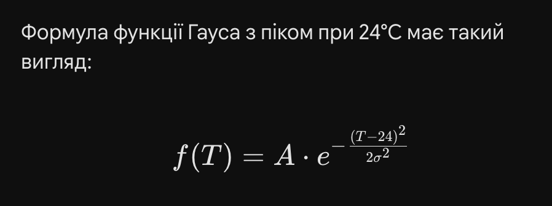
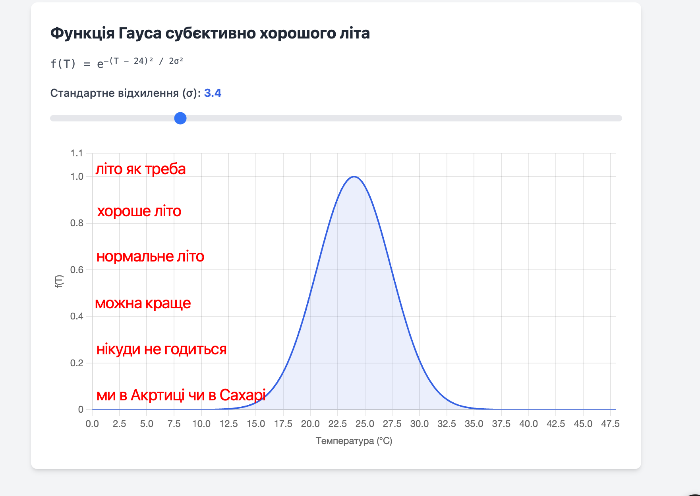
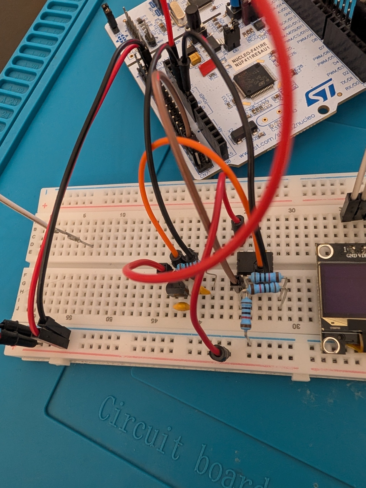
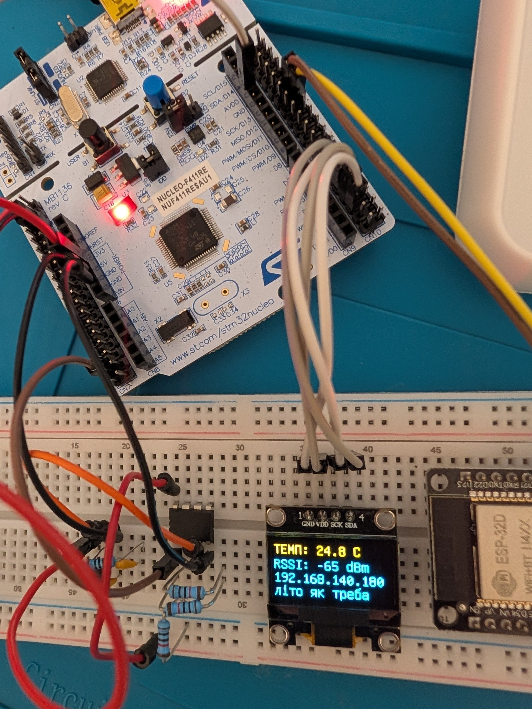
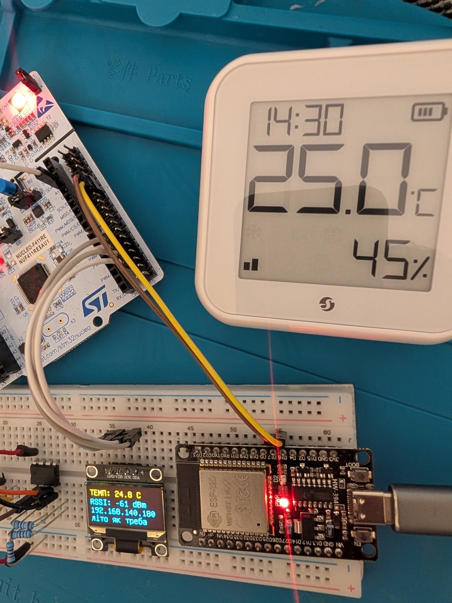
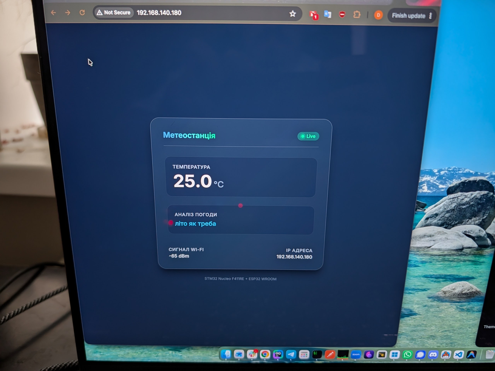
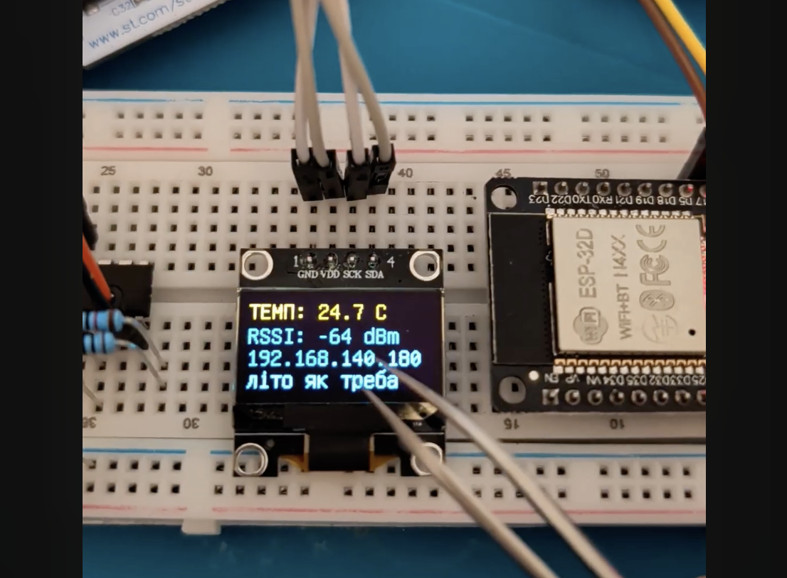

# Курсова робота

## Завдання

```
Загальний опис завдання
Основне завдання фінального проєкту — зчитати дані з аналогового датчика температури LM35DZ та візуалізувати отримане значення.
LM35DZ — це аналоговий температурний сенсор, вихідна напруга якого приблизно пропорційна температурі:
VOUT ≈ 10 mV/°C
Наприклад:
25°C ≈ 250 mV
50°C ≈ 500 mV
100°C ≈ 1000 mV
Ви можете самостійно ускладнювати завдання: додати фільтрацію сигналу, підсилення, довгі дроти між датчиком і схемою, калібрування, графік температури, додаткову індикацію або інші креативні елементи. Головна умова — основна суть завдання має бути виконана: температура має бути зчитана й візуалізована.
```

## Роздуми
План наступний. Виходячи з наявних компонентів (stm32 nucleo-f411re + базовий набір з початку курсу + esp32D WROOM з wifi) та завдання, зробити пряме підключення LM35DZ (з фільтрами) до nucleo, підключити дисплей та wifi.

### Місія

На цьому етапі виникає питання мети та доцільності проекту. Ми маємо hard-обмеження які самі ж ввели, але ми не знаємо як саме корисний буде проект та яка його мета.

Після роздумів було вирішено що проект може достатньо добре підходити для задачі субʼєктивної оцінки літа:

1. Температура літа вдень в Києві варіюється умовно від 10°С до 42°С
2. Нехай система датчика показує поточну температуру з кроком ~4°С (якщо обрати крок 2°С - зможемо міряти лише 16 градусів - цього замало)
3. На основі температури система оцінює наскільки літо субʼєктивно "таке як треба"
4. Графік критерія "правильності" літа по температурі побудований нижче - ми опираємось лише на факти, на сирі дані - без припущень.
5. При потраплянні температури в обумовлені діапазони оцінки літа, можна виводити текст в браузері чи на led-дисплеї.

Гаусіана з піком в 24°С, амплітудою = 1, стандартним відхиленням (σ) = 3.4. Чим ближче до нуля по осі Y тим субʼєктивно гірше літо по температурі. `1` - ідеальна температура -- літо як треба.






## Nucleo ADC

Підключити LM35DZ напряму до Nucleo простіше ніж робити Flash ADC. Якщо зробимо це грамотно - матимемо точніші показники температури через те що вбудований ADC має до 12-біт (програмно можна виставити 12 біт режим)

1. Датчик будемо живити через 5v пін nucleo.
2. Щоб мати точніші значення датчика нам необхідно додати фільтр живлення (decoupling capacitor) що буде захищати датчик від просадок напруги з nucleo
3. Також додамо Low-pass filter, щоб зрізати високочастотні наведення на виході датчика
4. промасштабуємо вихідний сигнал з датчика за допомогою LM358 (бо можемо -- насправді думаю що можна і не масштабувати)

[Source code для nucleo](./nucleo-f411re--display_direct/main.cpp) (писалось\генерувалось в vscode + platformio). Код виводить 2 однакових рядки з температурою + оціночне судження літа у відповідності до графіку вище.


### Підсилення

1. Датчик LM35 видає 10 мВ на кожен градус.
2. Підсилимо датчик таким чином щоб максимальна температура датчика (100 °С) була рівна 3v
3. K=3 ( `3v/1v`)
4. Маємо LM358. Розрахуємо резистори підсилення R1, R2
5. K=1 + R1/R2; R1/R2=2; візьмемо 3 резистора на 10k



Обробимо кодом підсилене значення датчика:

```cpp
// loop func code

    long totalReading = 0;
    const int numSamples = 32;

    // Збираємо пакет вимірів (sampling)
    for (int i = 0; i < numSamples; i++) {
      totalReading += analogRead(PIN_LM35D_DIRECT); // PC2
      delay(2);
    }

    // Обчислення
    float averageReading = (float)totalReading / numSamples;
    // число 4095 - максимум для вбудованого АЦП nucleo в режимі analogReadResolution(12);
    float pin_voltage_mv = averageReading * (3300.0 / 4095.0);

    // Ділимо на коефіцієнт підсилення ОУ (3.0), щоб отримати напругу датчика
    float sensor_voltage_mv = pin_voltage_mv / 3.0;

    // Переводимо у градуси (10 мВ = 1 °C)
    float temperature = sensor_voltage_mv / 10.0;
```

### Дисплей

1. Підключимо SSD1306_128X64 I2C дисплей до пінів D1-D4 nucleo.
2. Живлення виставимо програмно на D4,D5
3. Використаємо рандомну поширену бібліотеку для ренденрингу на дисплеї
4. Додамо трохи магії форматування



## ESP-32D (wroom)

Цей MCU має вбудований wifi, має UART порти та підтримує фреймворк arduino. Ще через свої розміри в нього відсутня проблема перегріву зі старту як у менших дешевших wifi-модулів.

Підключимо його наступним чином:
```
ESP D16 (RX) -> PA11 (TX) STM32
ESP D17 (TX) -> PA12 (RX) STM32
Живлення + дебаг - usb порт ноутбука
```



Навайбкодимо простецьку HTML сторінку з інформацією з nucleo та RSSI по wifi.



## Комунікації між девайсами

STM32 (UART):
1. отримує ip адресу вебсервера піднятого на esp, wifi RSSI
2. посилає температуру, субʼєктивну оцінку літа по температурі

ESP-32D (UART):
1. посилає ip адресу вебсервера піднятого на esp, wifi RSSI
2. отримує температуру, субʼєктивну оцінку літа по температурі


## Короткий список використаних компонентів

1. LM35DZ - датчик температури 0..100 °C
2. Nucleo F411RE - MCU з рекомендованих по курсу
3. ESP-32D HW-394 - MCU який був куплений до курсу
4. LM358P - оперативний підсилювач з рекомендованих по курсу
5. керамічний конденсатор 104 (2шт.)
6. резистори: 1k (low-pass фільтр), 10k 3.шт (для підсилювача)
7. лбж непоганої якості -- не довелось робити фільтр для вхідної напруги від живлення

## Що можна було б покращити

1. Придбати точніший, дорожчий датчик температури.
2. Прибати шифратор на чипі щоб якщо довелось робити flash ADC не мати купу виходів з нього
3. Спаяти схему, помістити в корпус (розібратись з 3s-друком)
4. Розібратись з живленням (наразі живлення іде від лбж та від usb для ESP-32D). Cпільне живлення lipo + dc-dc перетворювач. Домени по живленню непогані і зараз.


## Відео-огляд

[](https://www.youtube.com/watch?v=arMB5n7RM50)
