# Lab2.Завдання 1

Завдання:
1. вказати тип сигналу
2. виміряти амплітуду сигналу, частоту

### 1+2. Скласти схему, виміряти осцилографом навантаження
Vmax = 4.99V

Що відбувається?
Етап 1:
1. Замикання схеми
2. Напруга на резисторі поступово зменшується з 5v до 3.396
3. Тим часом одночасно з цим напруга на конденсаторі збільшується по мірі заряджання конденсатора з - до 1.6V
4. Діод поступово збільшує яскравість

Етап 2:
1. Розмикання схеми
2. Напруга на резисторі 0V
3. Конденсатор поступово розряджається з 1.6v до 1.3v (до моменту повторного замкнення схеми)
4. Діод поступово зменшує яскравість, гасне

Етап 3:
1. Повторне замикання схеми
2. Напруга на резисторі 3.6Vб, поступово зменшується до 3.396. Це зумовлено тим що конденсатор все ще має заряд
3. Конденсатор поступово заряджається з 1.3v до 1.6v
4. Діод поступово збільшує яскравість, швидше ніж на етапі 1 бо конденсатор повністю заряджається швидше

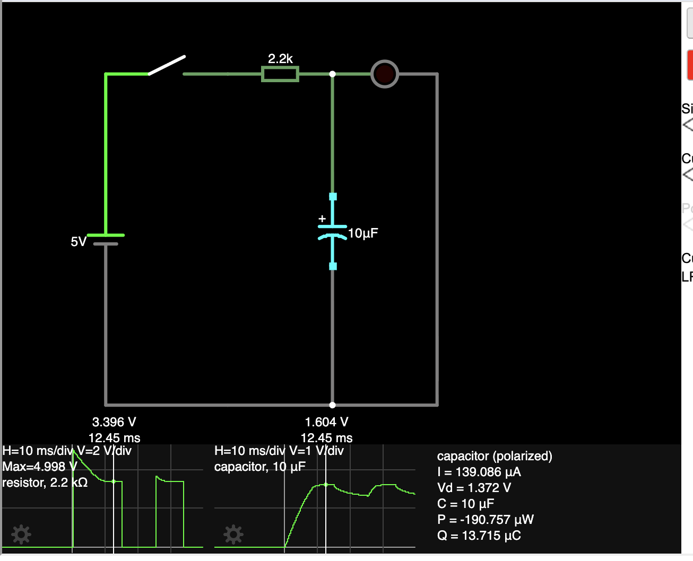
[falstad link](https://www.falstad.com/circuit/circuitjs.html?ctz=DwYwlgTgBAZgvAIgIwKgFwM6IAwDpsEECsqYIiRuALEQJwAcSRBAzC0lVQExWogBGiAGwooAB0EIqLVADcIFVAFtMFAKYBaJCgB8AKChRgAdygAPRBypQqtIVC5F7toangJsCAPT7DJ84iOznZQLERcNnZuON6+RqYWCGERLjZU9JGusDE+BvEBUulQSLQpRS7RHrF5wNCJQcWloeGNXJWeUAoIXFwE1X6yBVaZxZytlUhZxu4dSgCGZrKKuX4JiMmh2NYbJW3ZVStGYiAFGyxbzREsQvTtfDj4hNi0L69v77SkSx6Pohhds2+olkABNLLghNgWAB2IhhNg0GgI-r5RJnG6XTJ3Q7AAAyAFEACKnFq7NIZXZ3KBKAD2iBBahgcwArgAbNAaVlqEF8LqiEAAcxiUAEwqU-HIP2wKBxGCGYzJDUp+08OJpUDUADtELwoBgxMJde4zL09gaqnE-GIoN8OhhJSRDlabetUPaHjK4sAvDSveqtYhoW7zUIjYgzNxsGpUObdHlnba3ZKuLhHZaji6kkmPSjvb69N7wBB9EA)

Реальна схема (C=470mkF)
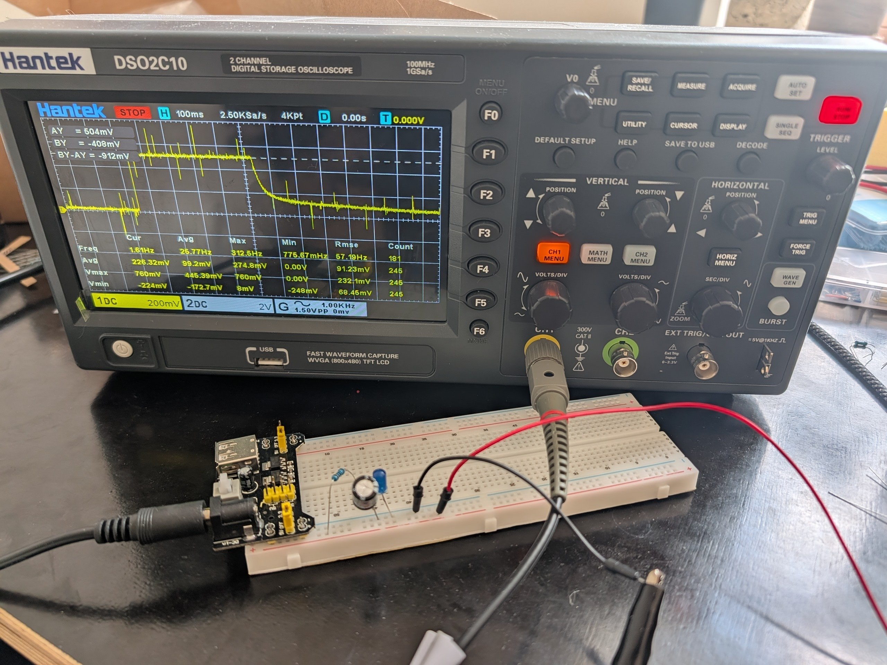
Виміряні значення напруги Vmax=504mV, після розімкнення схеми поступово іде до нуля

### 3. Під’єднати генератор імпульсного сигналу частотою 1 кГц до осцилографа.

Завдання:
1. вказати тип сигналу
2. виміряти амплітуду сигналу, частоту

1. Тип сигналу - аналоговий синусоїдальний сигнал (змінний струм)
2. 1kHz, Vmax = 3.6v, Vmin=-4.4V, Vavg=4V.

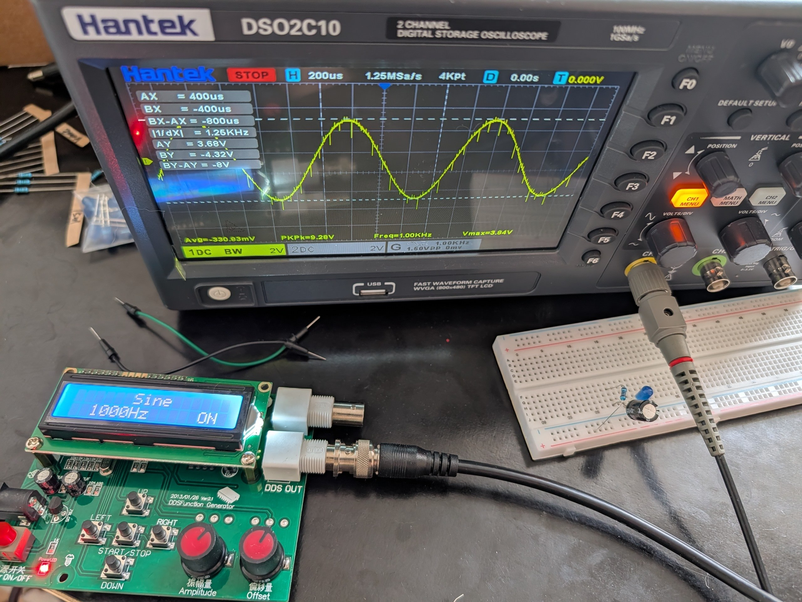

### 4.Скласти схему Low-pass фільтру  C = 3.3k Ohm

#####
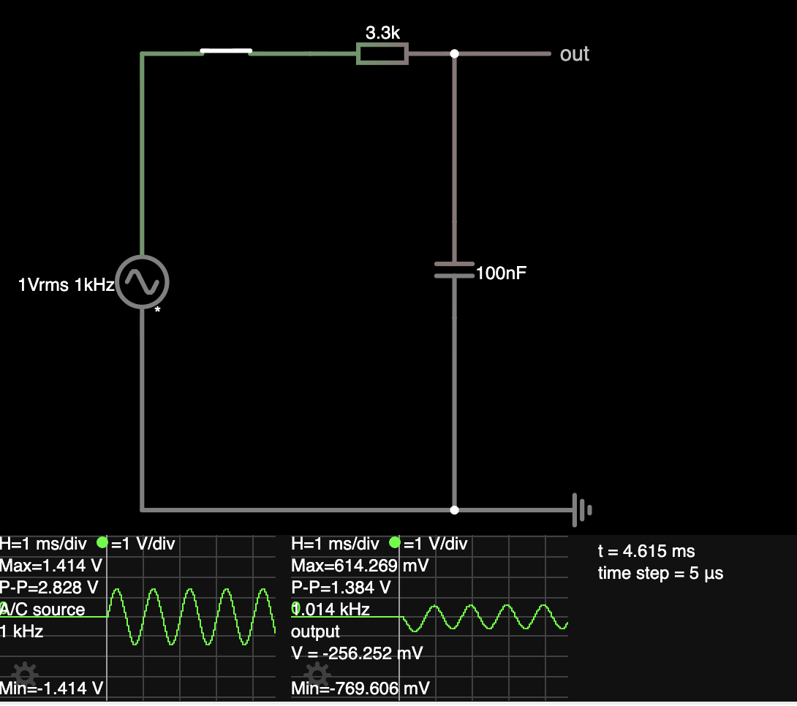

1. вказати амплітуду вихідного сигналу - 1.229 V/2 ~= 0.6 V
2. переконатись що частота на вході та виході 1 кГц - так. на скріншоті на осцилографі це вказано
3. розрахувати частоту зрізу: `f(c) = 1/2*pi*R*C = 1/2*3.14*3300*0.0001 ~= 482 Hz`
4. переконатись чи працює low-pass фільтр та чи пропускає задану частоту 1 кГц: ми подаємо 1кHz, фільтр має пропускати 482 Hz максимум. На графіку бачимо синусоїду з амплітудою в 0.6V, тобто пропускає але зменшує амплітуду вдвічі + синусоїда на виході трохи "запізнюється" - незначний зсув по фазі

[flastad link](https://www.falstad.com/circuit/circuitjs.html?ctz=DwYwlgTgBAZgvAIgIwKgFwM6IAwDpsEECsqYIiATLgGwActA7NQMwCc21ALJ9Q0RahAAjRNRJQADiISdmqAG4RE4gLaZlAUwC0SFAD4AUFCjAA7lAAeiJNyg9OUCkWp2uqeAmwIA9IeNnLSmdXB2Z+EPccHz8TaCsEJxckamwoMIooZK9YKKglBGZmAmijE3N49McGDMqsyM8S-3LESsKXSvt6r19S4AxA5Fssx2C6nIae-3kBmwdh2Yjx5NRTDxRYfKRCVBUAQwt5a1xOGwokMOoKZgYi1iIUSZMQAcqKarTwtq7BI8I--8ISG0DFIh08+Gw6ww+Wy8gAJogtHhEk4znckEQbmESI9gAB5F7hYayDJjDzZDDkCYxYAAc0JGXsdmYjLc426NIA9lANAA7USoDASRC0eoWFLYZhIXaoYUNGL+CRQMEUqlUVRYZA7OUc0qK5UtQVUvDrFSavDYVQ6xombycrk8-kIUVQIUisUMAhSmWSawIBUmJUqo04fBIO5Spw7TWm624u2GYDecAQQxAA)

### 5.Скласти схему Low-pass фільтру  C = 330 Ohm

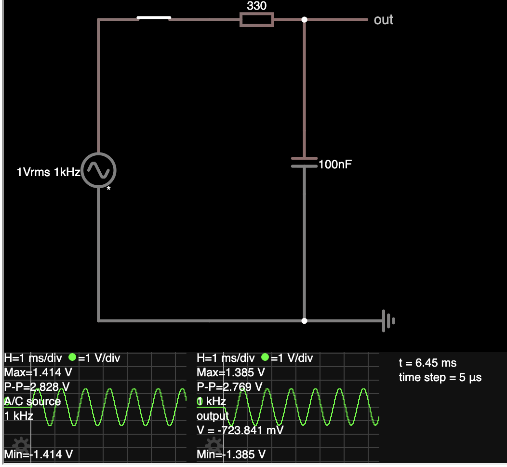

1. вказати амплітуду вихідного сигналу - 1.386V - наближена до вхідної мінус опір резистора
2. переконатись що частота на вході та виході 1 кГц - так. на скріншоті на осцилографі це вказано
3. розрахувати частоту зрізу: `f(c) = 1/2*pi*R*C = 1/2*3.14*330*0.0001 ~= 4820 Hz`
4. переконатись чи працює low-pass фільтр та чи пропускає задану частоту 1 кГц: ми подаємо 1кHz, фільтр має пропускати 4820 Hz максимум. На графіку бачимо синусоїду з амплітудою в 1.229V, тобто пропускає але повністю мінус навантаження на елементах. синусоїда на виході трохи зсунута по фазі

### 6. Дослідити АС-coupling

##### DС-coupling:
Відкритий контур: R1=1.397V, R2=0V, синусоїда така сама, амплітуда трохи впала через резистор
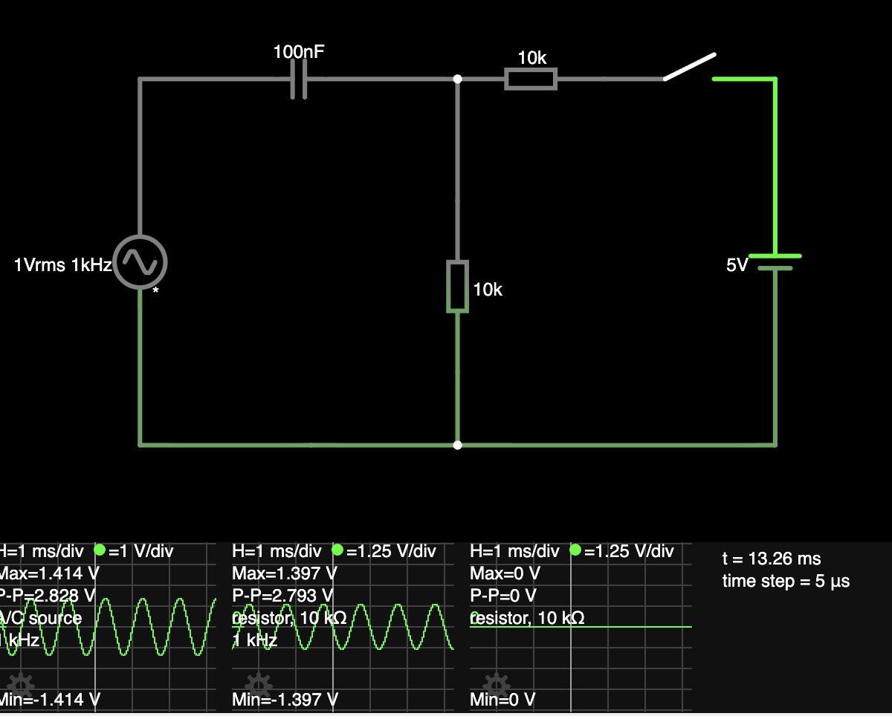
Закритий контур: поступово амплітуда зміщується. R1max=3.8V, амплітуда зміщена по осі Y вверх, крім цього сигнал той самий що в п.1. R2 - те саме що в R1 але зі знаком мінус.
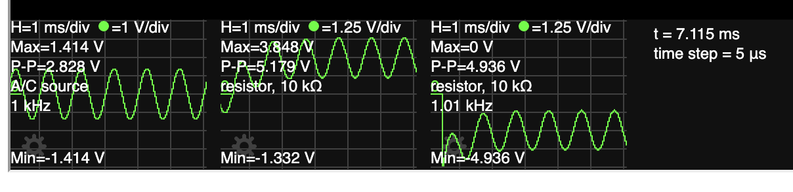

##### АС-coupling:
Відкритий контур: обидві синусоїди такі самі як в DC-coupling
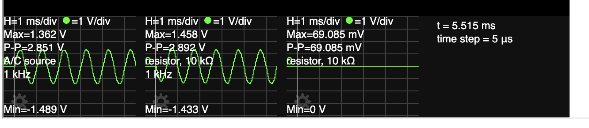
Закритий контур: показники синусоїди R1 відцентровані по нулю, тобто R1max=такий самий як у відритому контурі. R2 такий самий як R1.
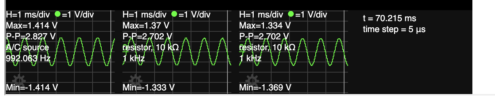

AC-coupling схема
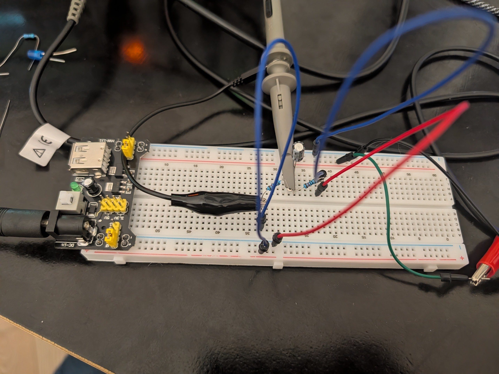

AC-coupling режим на каналі 1, розімкнута схема, R2
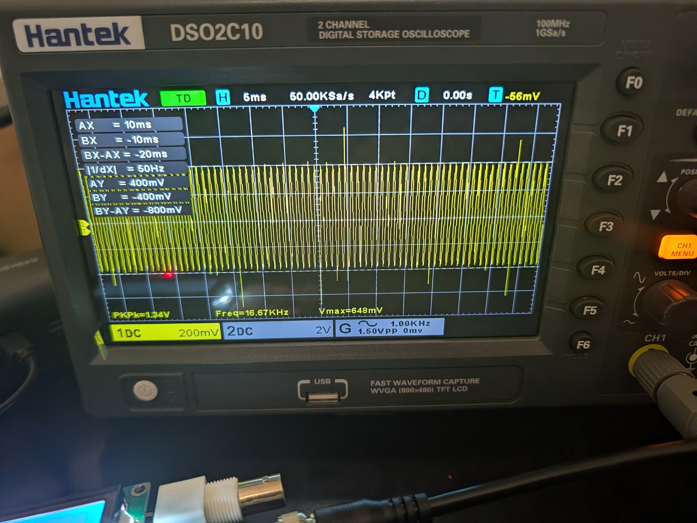

AC-coupling режим на каналі 1, замкнена схема, R2
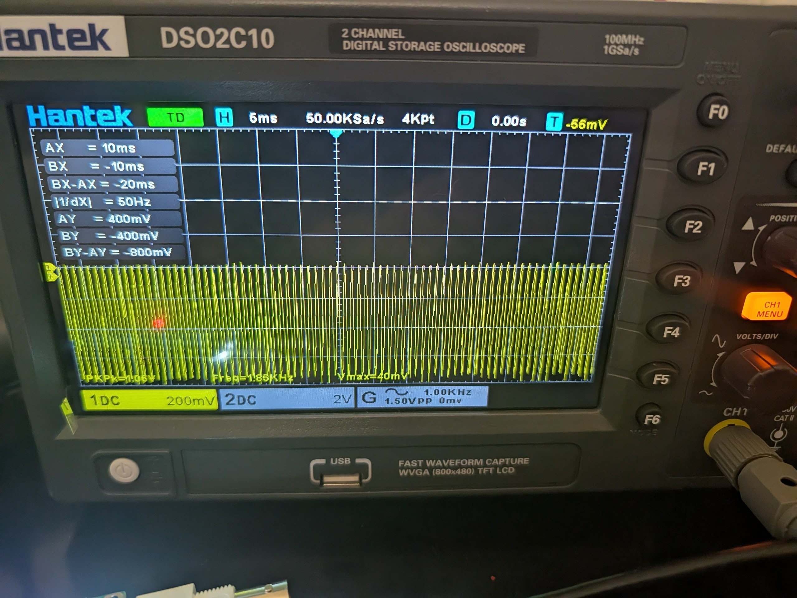

AC-coupling режим на каналі 1, момент вмикання, R2, напруга трохи скаче вверх, потім вирівнюється з центром на 0V
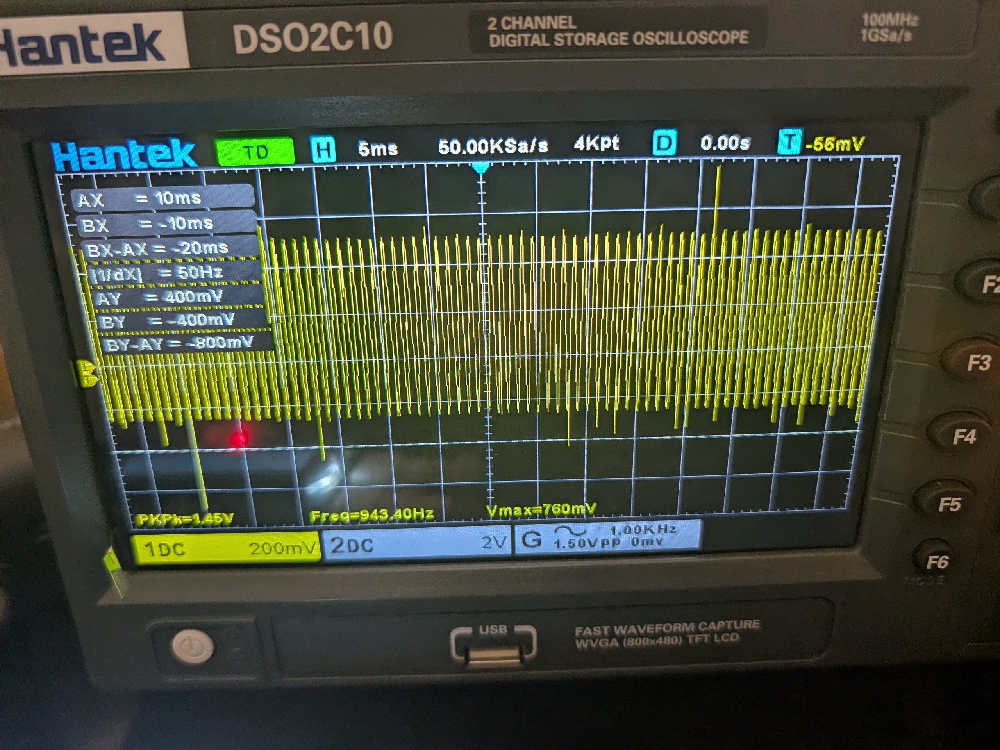
