# Lab3

### Завдання 1. Дослідити силу струму в колі при прямому та зворотному підключенні.

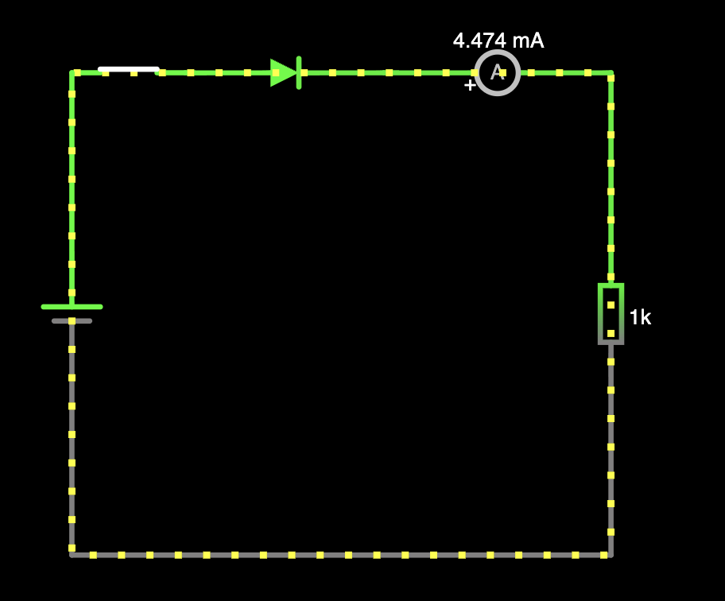
пряме підключення діода - - 4.474 mA - струм проходить

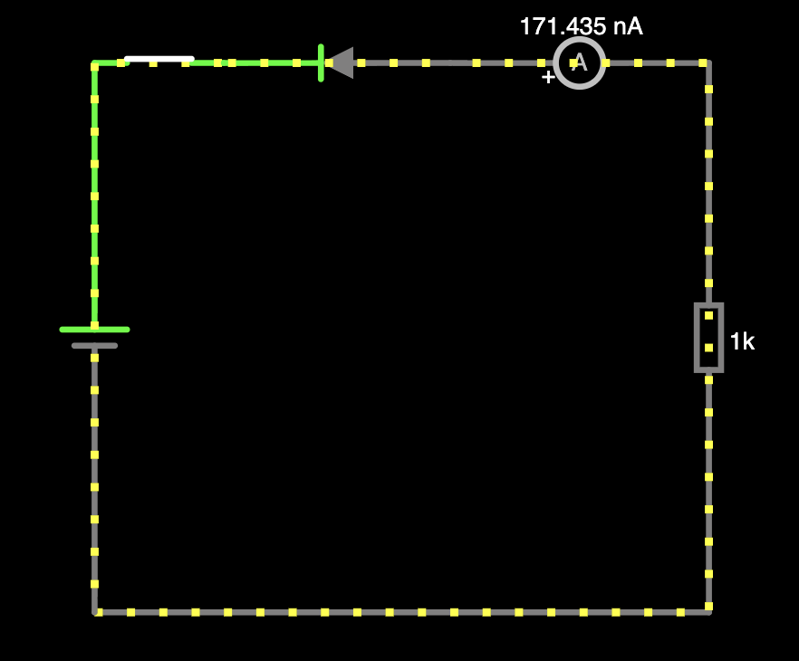
зворотнє підключення діода - 171nA - струм замалий щоб бути релевантним

### Завдання 2. Скласти схему однопівперіодного випрямляча на діоді.
Відкрита перемичка:
* Вигляд сигналу: тільки верхня компонента синусоїди, нижня гаситься через діод
* Vmax=967mV, f=1kHz

Закрита перемичка:
* Вигляд сигналу: постійний струм, поступово збільшується поки не стабілізується в Vmax
* Vmax 844 mV

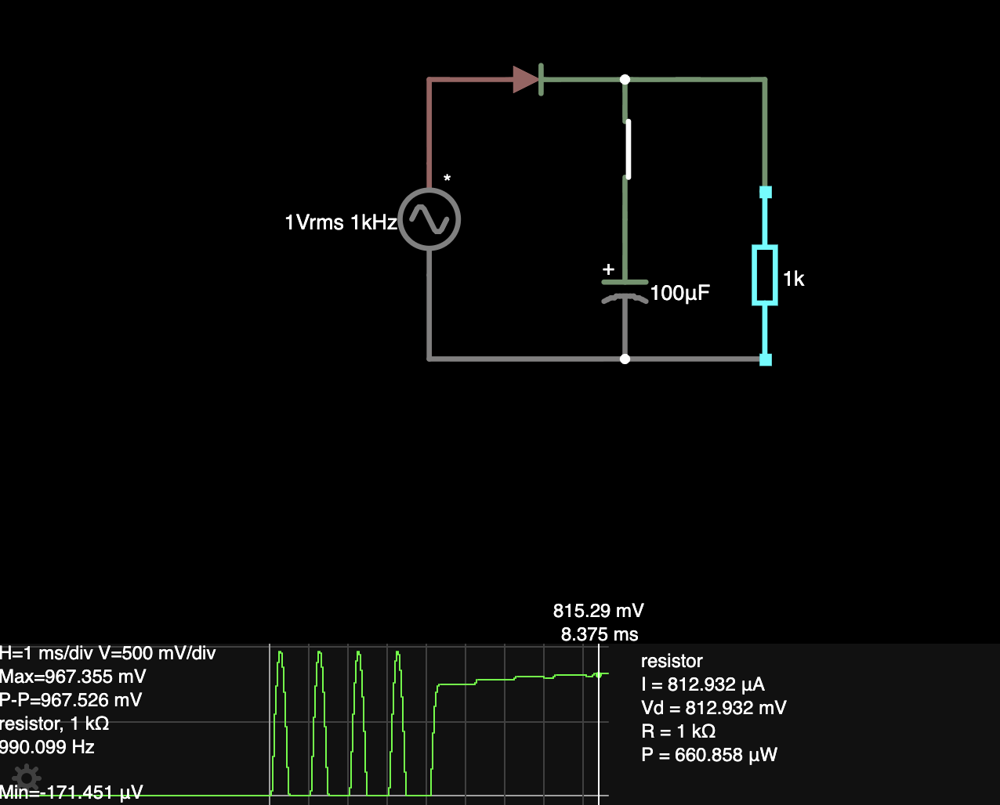
[лінк на falstad](https://www.falstad.com/circuit/circuitjs.html?ctz=DwYwlgTgBAZgvAIgIwKgFwM6IAwDpsEECsqYIiSuATEgBxUAsAnAMxMBs2A7Niw1y1QgARonYooAB1EIGgqADcIiElAC2mFQFMAtEhQA+AFBQowDFAAeiFrQZRa2KLftJOqeAmwIA9MdPA0Nay7K4M9gyhUIzesDioysiEvv5mACZWiFRcVA5OLnke8eoA9ohpWjAAhgCuADZoKSZmkiCZCAVu+XbRDLGeseRe+IRMY+MTk0ykCjgjEhiJsWqzyKgKaXO0SFSsbuziLEhMAgxNAQDu7ZFhEVGORV7nZlfBN3nOPQ9xT37NwK9EO8Yp97DFHt4-pd2gUQdlcuCfpDUsAFO14VBjgicpiqLRHm5UBdPBIYIkkMl1FVLKtKAwkAwaCwiOwqCwBNgmEQUFCXuicTtaNEcd8Bs8AfzcljhQi+hDxSUoFoAHYUVAYSSIfE-Sx9NnYKqoTVPVIBSSKYoYIZ4DgCIj8Cn8Lkski8s0Wjrq60jbA8lE+ErGYA+cAQYxAA)

Проекспериментувати з ємністю конденсаторів 1 мкФ, 10 мкф, 100 мкф. Вказати рівень вихідного сигналу.
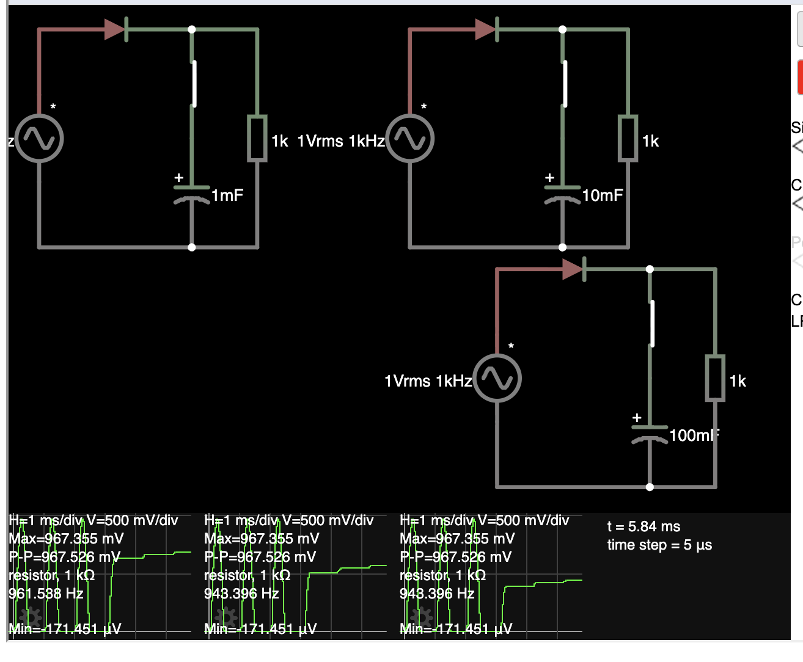
рівень вихідного сигналу: у всіх випадках вихідна напруга стає 841mV, але час перехідного процесу різний.
с=1mF - найшвидший, 100mF найповільніший.

[лінк на falstad](https://www.falstad.com/circuit/circuitjs.html?ctz=DwYwlgTgBAZgvAIgIwKgFwM6IAwDpsEECsqYIiAzErgCxICc2AbE9gEwAcRT9NbqIAEaJWqAA7CENCqgBuERCSgBbTIoCmAWiQoAfACgoUYBigAPRElZQaHKFez3OqeAmwIA9AaPBoFhGzYdrZQgXZhLjioCsiEnt7GACbmiCEhDjYckW6oygD2iInqMACGAK4ANmjxhsZiICnI1kic9tYRsFFQ5G742ChQYLI4fQMYMe4qw8hyiSMA7Fx882wU9ExI2Cv0KF61wADujWGZbY622e57Pkf+JycZHa5XCYeNj0GnT1HXxrKN6WsIXW2SsqAOrgGMBimwIuRKZmm1DofCQFG4q3mFGw9CIu1et1SdnWpwunRyvze-kB53CQUuNRujQogTOUBZjm+FIJzNZJI5mQZlP+-gFGQFIPJYKgEMsLhhcRUCKRtCQqPRTEx2Nx+P2hKkLNCnwFXJeeoBHE5n2kbCNWXJZqZ1MtpMNZOejLqDWphpawUNpoEI36pGmeAIYwmuSRsxGTHmRHYSCI82YyaQ8yYnuAyVFrLSbvtHpUBQQRVKlWqlL8RNpmStRa6CrhlNMPttBdtfqFPNFHBo7IoTHZ-ZHNB75r7A7YKzHoTY44d2ZFlFHFCHc5n-ClWZlkPllkVymVllV6oxFCxOLx2f1NH5a8fi49lP1RBoA4oo-vw6-z5+vaKB+84Dj+IETj49QAvy2CgQ+-45N0IwDEMwYhlA4xdMoMZQLIcy9EQ3DxkQHAsoEDDxvQ2a5qu04LjYJJsAuDIloUxTlFU2Y1gg750QOvFjixzaOsYbapIx9FgdiCEicAeRQOoAB2coYWIiCNggZg0Ow2IlOIUQJJBuFdBgPR4IsrCcCsrD3lwTGekZ0wyBhZl9CGlIeHkrzyUplj2hgakIBpWk6dgelQIFei1I5JmucRWwZnwjCrOsJC-DFCDOaZaHua8nneQpykBP5gXBdpqxhfpAQIIZdTGYh2UEUR8z0P2pEpqwMjpXVTmoI14YRtm+X6MAHjgBABhAA)

### Завдання 3. Двопівперіодний випрямляч на діодах

1. коло розімкнене -- струм не тече. Falstad на дефолтних налаштуваннях зарядив конденсатор струмом ¯\\\_(ツ)_/¯
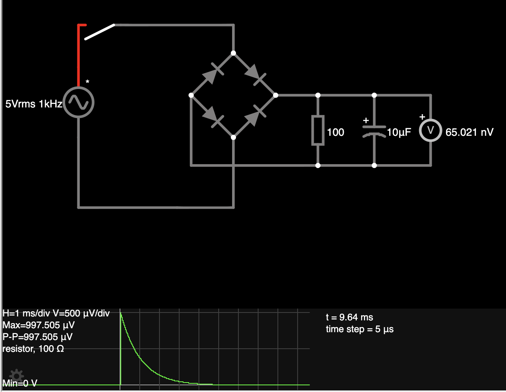

[лінк на falstad](https://www.falstad.com/circuit/circuitjs.html?ctz=DwYwlgTgBAZgvAIgIwKgFwM6IAwDpsEECsqYIOuALJQBxIBsNAnNgOzYDMHN29l9qEACNErJqgAOIhJQ6oAbhEQkoAW0zKApgFokKAHwAoKFGDQAHom6UoDbFGtQATJWyp4CN1CXICCAPRGJsASIFCWMrS29PbUNM6u7jiCFIQETBmZWdniUGDyyVAYPl6qBcgKACYUThys9PRE7BxITkhM9EicAUGmAO7hiE408cOjLs4jSZ49xv2DCE4TY7atkzTTboFzwPILek7O2PEHtsPTDKh9HiiwPl1+agCG5uWs+Kxd9Kx0SDSNlFYRBI22CAwipycx1WhzGm1mwQkCyIazsUBRsMSsCsqFUmkKGHIM28+N8aT8oPmEQx0ViUTs8MpwHBiDitIcNBsDOxMyZLIQNJcdNGWI8W16zIWbKFHJsQsZEv5jhlKtFySZlQWK1OXHotPhagA9ohKpoYE8AK4AGzQCNMmoiKyh8V1+p5pWNCFN5utto1Wtc7O1rQNqk93stNrtwAdQ0DaKdx1D4bNkb9ioWjjRru5Yuj-NV9hlufVGcdIyOowrcPd+a1FZ47J4Cp2BYbRYrBxbwQw+xiUEbp2btagEkQKD5+1RwxhA68eaZhqgmgAdgSxwgNjzzK5atgnpJkr1EVByl5CcpcKwONgWJQiEwfqxXBxKHaT+U5EUiXhCBOJf4hpGMA-jgBARhAA)

Що відбувається при зімкненому колі: діодний міст має 3 входи і 1 спільний вихід. Це дає змогу перетворювати відємну компоненту амплітуди перемінного струму на позитивну компоненту. Це дозволяє перетворити коливання струму з -Vmax:Vmax на 0:Vmax. Далі присутній резистор та діод. Діод встигає зарядитись так швидко і не розрядитись так швидко, щоб амплітуда ставала схожою на пряму як в постійному струмі. В залежності від резистора (слугує як навантаження - умовний споживач струму) та конденсатора (слугує як згладжувач амплітуди) результуючі коливання більш подібні до прямого струму або менш подібні. При відсутності конденсатора маємо просто коливання 0..Vmax
2. 1mkF:  Vmax = 5.753V, Vmin=1.008V
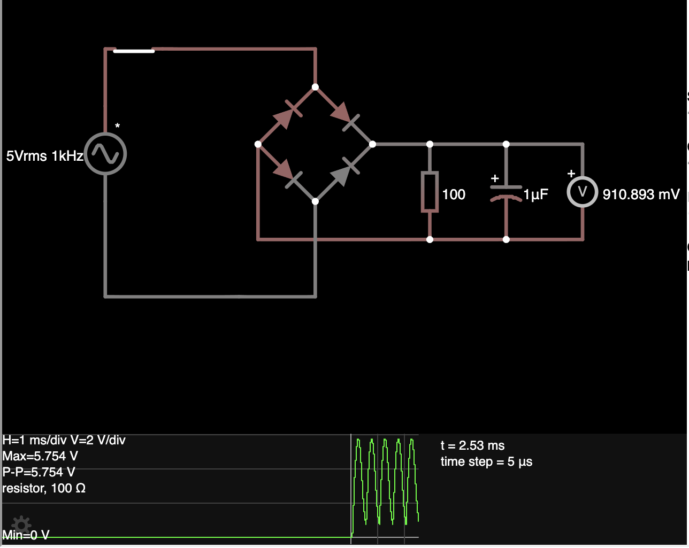

3. 10mkF:  Vmax = 5.731V, Vmin=4.192V
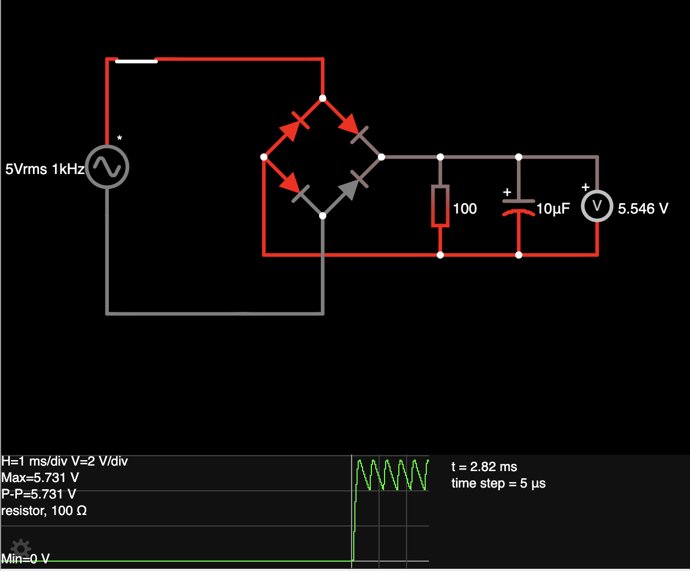

4. 100mkF:  Vmax = 5.57V, Vmin=5.399V
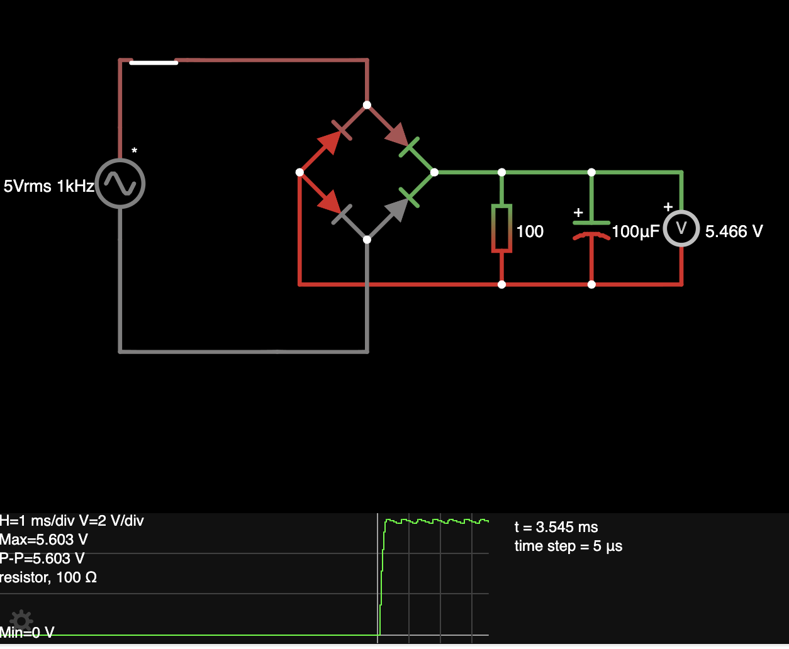

5. конденсатор відсутній: Vmax = 5.755V, Vmin=0V
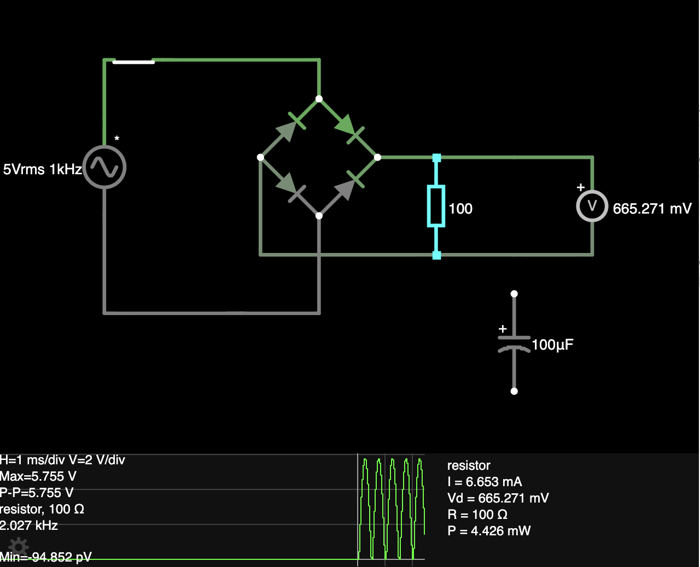

### Завдання 4. Скласти схему електронного ключа на польовому транзисторі

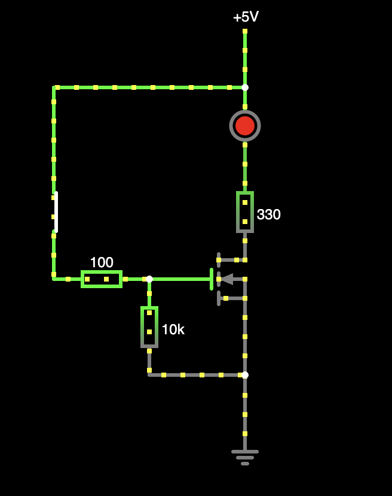

[лінк на falstad](https://www.falstad.com/circuit/circuitjs.html?ctz=DwYwlgTgBAZgvAIgIwKgFwM6IAwDpsEECsqYIiSeATAVQOx0DM2AHFQGwCcndqIARoiLZUAB0EJhqAG4QhqALaYhAUwC0SFAD4AUFCjAASlAAeiRo3ZQW2KBatJ2qeMidQA7i5FQFAQxPS8gD0uvrAADIAogAipuaW1rb2UEgALKnOOIoA9ogAJiowvgCuADZoaqUqeXxyyHwA5llQAs0K-OQIeNgoIXoG7nEIyTYpdFY2mV0IfWGDZsjjiWMOVCxTIrMGGENIS0hrK1BUqd5eM6EG0At7Vie2VER3pxuodZSbl8DXiI-PD087DRXlB3oRPv1vkNkmlUnYElQTiC6hYIWEYEM-sdTvD-lNGFQZGgKLgSFB+CocPhCVtgPN4ndAckCWcsrT6QgsSzcUDWdNaQ1oQlucyWBlYGzdMAguAILogA)

Що відбувається: при замкненні схеми струм 5V іде на резистор 100, котрий разом з резистором 10к утворює подільник напруги. Це дає струм 138mV на G(ate) транзистора, переводячи його в Лінійний (Ohmic / Triode region) режим утворюючи між Drain та Source ніжками контур.

### Завдання 5. Скласти схеми підсилювача сигналу на біполярному транзисторі

[лінк на falstad](https://www.falstad.com/circuit/circuitjs.html?ctz=DwYwlgTgBAZgvAIgIwKgFwM6IAwDpsEECsqYIiSAbJbgMwAsA7AJy0BM9AHLe0o5ahAAjRJU6oADiIRFsqAG4REJKAFtMygKYBaJCgB8AKChRgAJSgAPRD0pRO2KLahVU8ZAKgB3d3LUBDS3llBAB6IxNgLysbWjsHF357P18wiNNoa2Qkvjs2Tk5Ez1SoJQQmAjTjDJjs+MdcorccVDKKyvDq4EzY+qc4l0oUltLYjvTgAHNaxvzCxtoiNmaEOU7ItFq5ov67XJW-CQA7ClQhTQpKtQB7RAATTRh-AFcAGzQFc8RtPBZGNmwjCIlCYbDYlEY2GWUHkQnIq1wRGY2GYzA4kJRTFk4nWphAMxyOSQbCasBG8LwhAIKCgYGCCOpqAwZT88juFFw9AhBQY9GwnGoXIEuO6tWcSDRuygcwOrUu4y6PTqO1mBVlowQYMIVUi0SyqsKzhlZNWOtM8hmxJVVuN7lc3jtbjKSG1ASCOFwSHoXrYSEWlDYtEYtBRRFoZqilpJ2wNspFAHkxQMqI4ufRBsNTVAMBSI9coJoTsgaRgJIhxCbLHzA9h-JIWulIhIYSMcx6vT6-cDA8HQ+HcU2Wwhw9mKfhGSLQtcJvnCxQR6XyysqwQQ3WoGXkAhG6Zm-S-G2ZIjsLRuMxGKCBZRmDiJlOjMBQuAIEYgA)
1. Конденсатор тільки починає заряджатися, струм 5v іде на вихід
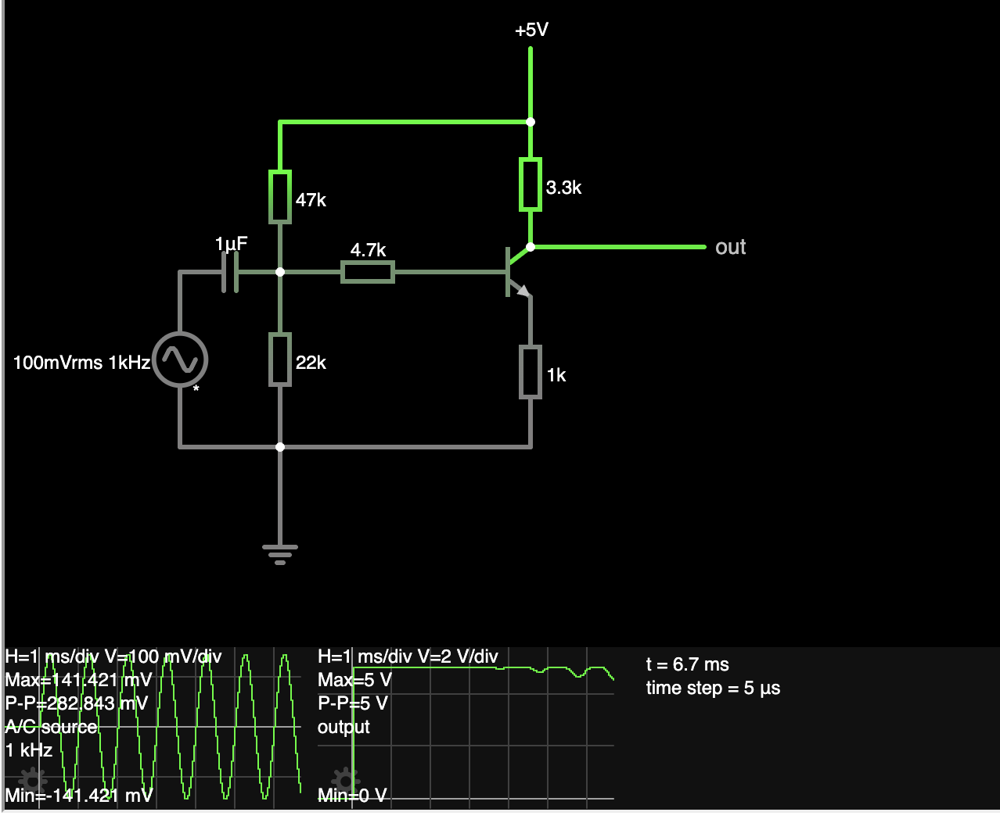

2. Конденсатор заряджатися далі, струм починає проходити на B(ase) транзистора (в момент 0.6v).  Це призводить до того що транзистор починає відкриватися і переходить з режиму cutoff в активний режим.
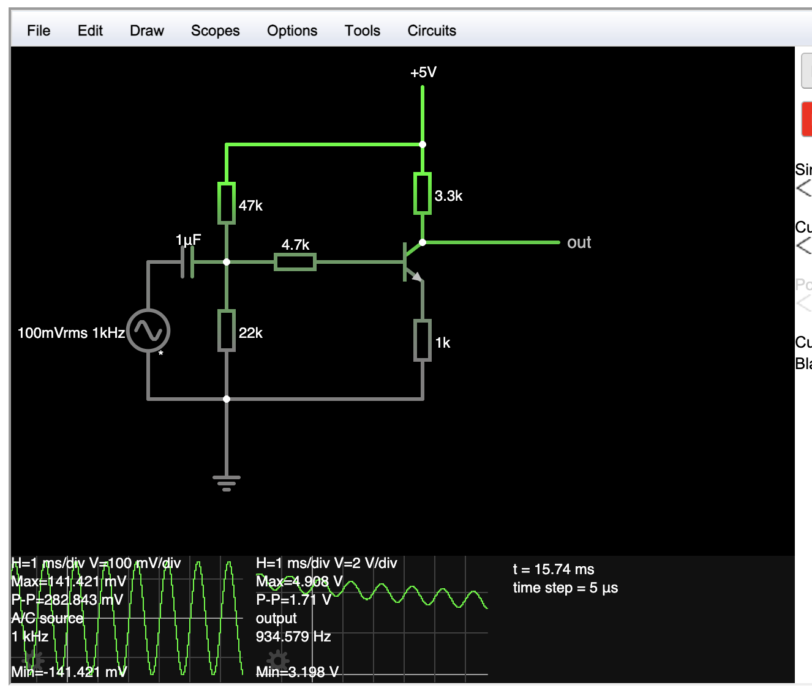

3. На виході починає зʼявлятися синусоїда. Чим далі тим більше змінного струму потрапляє на базу транзистора. Напруга на виході стає меншою, синусоїда стабільнішою. З часом транзистор відкривається наполовину (за рахунок того що автор схеми розрахував подільники напруги, конденсатор та резистори так щоб на базу йшло саме стільки напруги), це призводить до того що синусоїда стабілізується на конкретному значенні V=857mV. Цей момент активного режиму роботи транзистора називається Робоча точка (Q-point)
4. Сигнал AC генератора посилено. Він все ще 1kHz, амплітуда збільшилась до P-P = 857mV
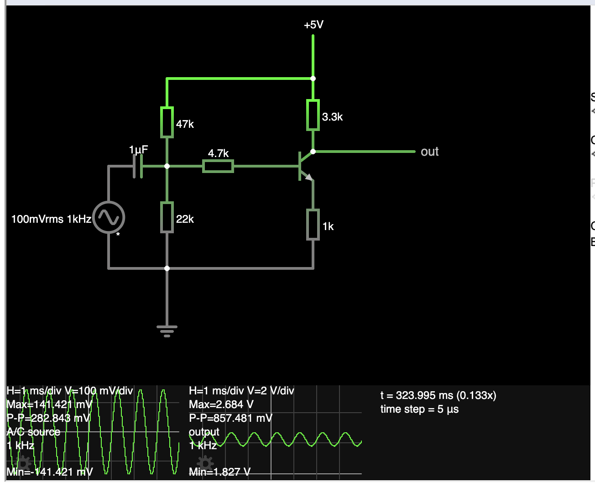
