# Lab4

### Завдання 1. Скласти підсилювача сигналу на операційному підсилювачі.

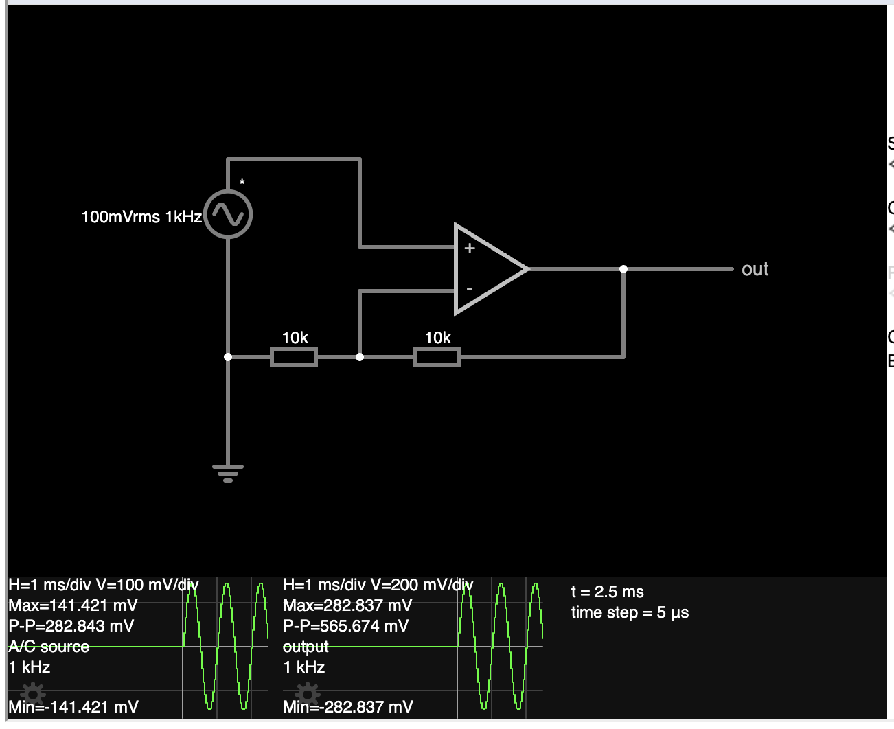

[лінк на falstad](https://www.falstad.com/circuit/circuitjs.html?ctz=DwYwlgTgBAZgvAIgIwKgFwM6IAwDpsEECsqYIiATLkgBwDMS2RSALLQGwXY0vuogAjROxaoADkIRFsqAG4REJKAFtMigKYBaJCgB8AKChRg0AB6Ui7KBUtQ67Gtcup4CGVAXJCMgPQGjJlDmCDZWoVBI7NhOfLA4qJ6MhAh+hsYA7kEWYdwxMS7xqQGZweFIAOxhtjoUBW4p-sayWchREQCcFBFtNXWRqOmuKLCJySoAhqayONRsLBRIdJYUdOV02O1EdA1pwCWIkdE1eb1x9UUZLYcnPZ11vo3AAOZXbWVtdPb3O8Ut9o7hFgsAHOM4PXb7BBAxxITpQaH5ME-YwAeRaCNhXSIQI6tSRUAw5HOj3GLTKcIxdzO7VQynGilpYEQmiUT3pXm8yOAAHsoOoAHaIUQEsSIGh1UwsbArbDjcTxRoBMRQab1AlEvCsVgLJacVbrTbbC5KlWIbbqmaEFAXYA+bmPXkCg7uDCihDis6S6XrOVQN16NIm1UujW4Cg0cOrJhENZLbAsVZcu0GW3gCAGIA)

Вказати частоту та ампілтуду вхідного сигналу та амплітуду вихідного сигналу. В скільки разів підсилився сигнал?
Вихідний сигнал: синусоїда 1kHz, Vmax=282.8 mV (підсилено в 2 рази), фаза співпадає зі вхідною.

`K = 1 + R(f)/R(in) = 1+ 10k/10k = 2`

### Завдання 2. Скласти осцилятор (генератор синусоїди) з мостом Віна на операційному підсилювачі

RC ланцюжки R=10k, C=10nF: синусоїда F=1,6kHz Vmax=3.126mV (відносно бази в 2.5V)
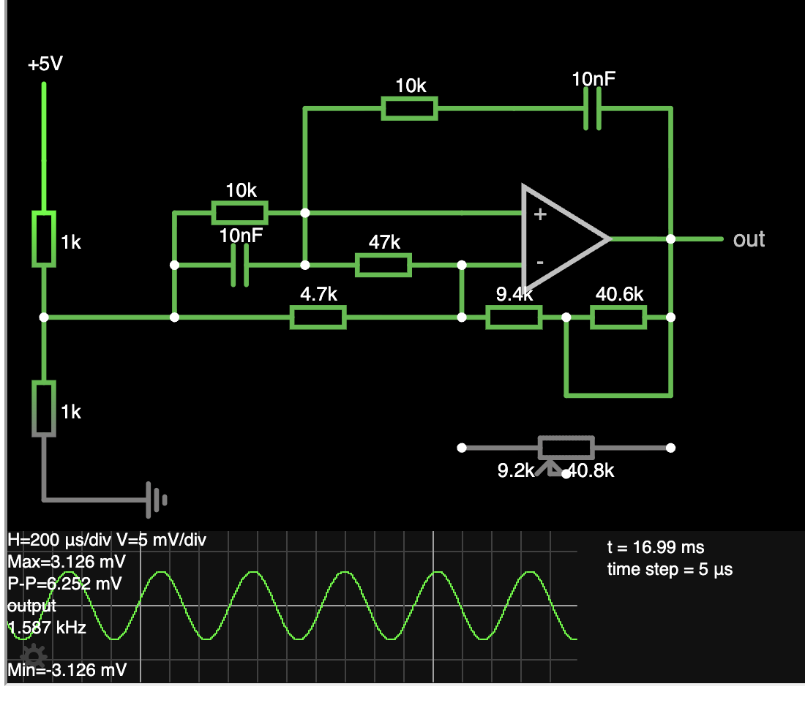
[лінк на falstad](https://www.falstad.com/circuit/circuitjs.html?ctz=DwYwlgTgBAZgvAIgIwKgFwM6IAwDpsEECsqYIOuA7JdgMwAstlRAbABwBMSRTAnKiABGiFi1QAHYQkaoAbhEQkoAW0yKApgFokKAHwAoKFGDQAHonpsoSSiyiWoHSh1TwE2VAuSEEAegNGJlDm0lZOHPZWtGz0rjieiEg+-obGAObBFlEx1kgR0bGw8SmBAEqZoda2kbkuRchiUADubh4qAIamsop+AcZNFQ7h1hxhznHuvanAAyF5YxHzjvRtrVOBZomjjthhuztsE21eScl9oBVLHCsHy6vxUOTIWodQYN3u+NgoUBhebbIACaIDi4SwsHREHS8ehEGIcXiUdb9S7ba7YEZ7V5rEookIcfbo24E7HFc6zEGEqlWJD0Qo486bBAku5QWjYeh3I4JaQ0AjImYVdmconCxzjeoeXFBOZo5xsjniuprKBeeh8gVMlm0zm0Wh2HXc1WJQhS84gIX66x0+y0RZ0o1PJAvUgfPAEH5-B5AxCaPBESh6+gcYUsSh07DXAXtIWKjjXW0ReP0xD8DqJJTKMC+7ioNLtE2mgUU5nUhUi3bc6Ulxj2zm1xxRyXFwZ2xv1tvhKvnADyraTCcsGOTRowTzN03EaFjuqIEXoSDstDnE0zBYQRCLUHEAHsKEg2HbTcfCLRUBgADaIUrqDBgDBodoAOxA6hbIQbwwbR+70xrbaPNl2DZAlf0CEt9SiAkgIWMDjCZMVhkgpUjS8GF+WlBDgK-TsJRVNVsBYDDzh3KB1CfSlz3EEEJlMFY6GwdoJHiPpAnEeofjdc8ng4IhcFGOckGiOc2FE6hYmlXwdwMYBfHACADCAA)

RC ланцюжки R=10k, C=50nF: зміна частоти: F=1,6Hz -> F=320Hz
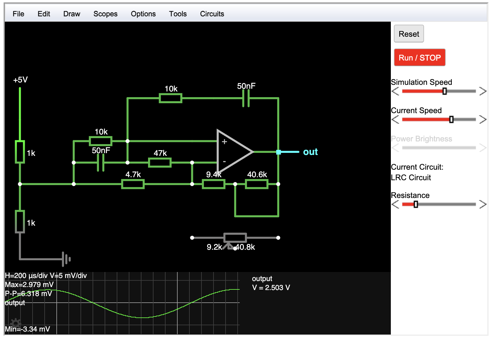

RC ланцюжки R=4.7k, C=10nF: зміна частоти: F=1,6kHz -> F=3.8KHz
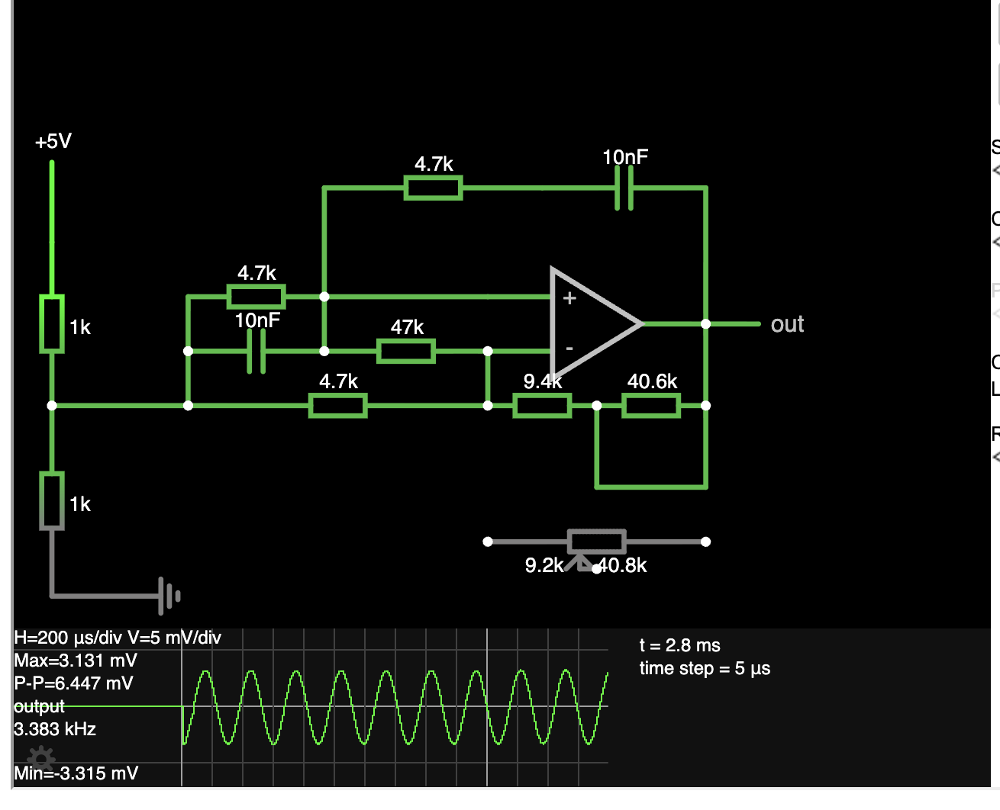

RC ланцюжки R=20k, C=10nF: зміна частоти: F=1,6kHz -> F=800KHz
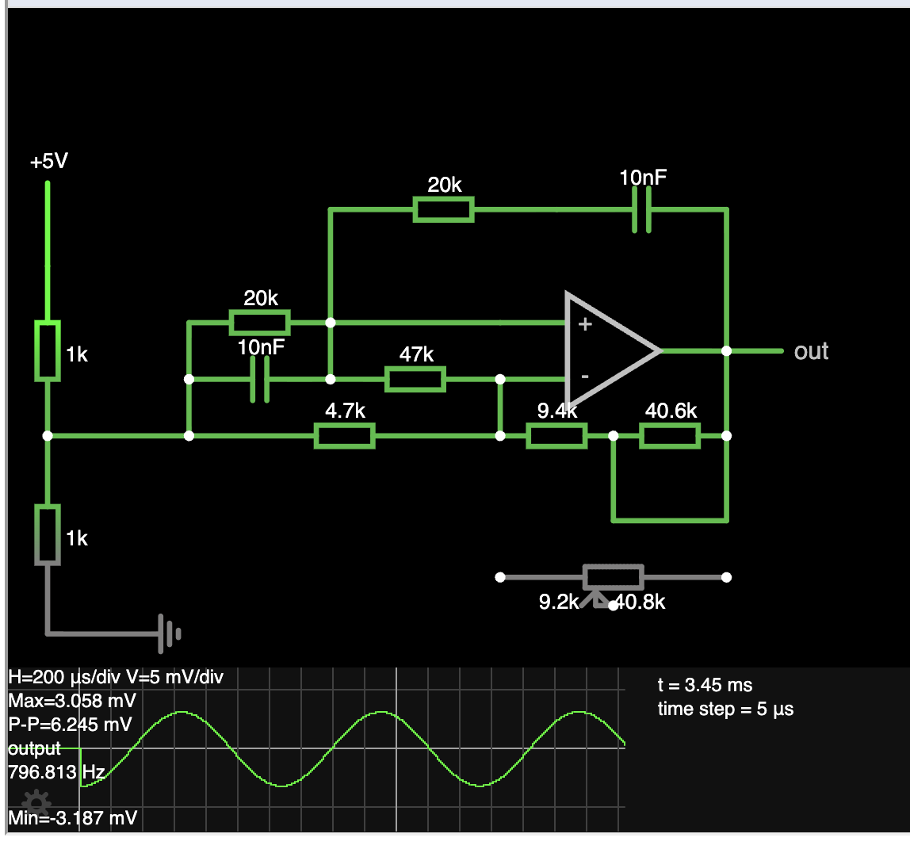

В залежності від значення підлаштовувального резистора (котрий в falstad на номіналі 50К не дозволяє підігнати коефіцієнт підсилення 3), будемо мати синусоїду що сходиться до постійного значення, синусоїду що розходиться до граничних значень підсилювача, або стабільну синусоїду при K=3.
Чому 3? Коефіцієнт передачі (ага, тут вигулькує теорія автоматичного керування, коливальні системи) моста Віна при співпадінні по фазі (при резонансі) сигнала що підсилює з вхідним сигналом, дорівнює 1/3. Для того щоб синусоїда була стабільною потрібно щоб коефіцієнт підсилення компенсував коефіцієнт передачі моста Віна. β(1/3) * K(3)=1. Тобо має бути коефіцієнт підсилення 3.

K = 1 + Rfb/Rin
3 = 1 + x/4700
x = 9.4k Ом

Тому замість підлаштовувального резистора на falstad в якому неможливо підлаштувати 9.4к Ом, я взяв 2 резистори замість нього.

Подальші думки: Осцилятор ми склали, але він по факту або видає стабільну синусоїду амплітудою аж 3.126mV, або видає синусоїду що сходиться або розходиться.
Рухаючи підлаштовувальний резистор в falstad ми бачимо що амплітуда здатна збільшуватися.
* Використати lc-фільтр ми не можемо, бо він не зробить з незбалансованої амплітуди збалансовану.
* підсилити амплітуду синусоїди класичним шляхом як ми робили це раніше - не дуже вдала ідея бо ми "масштабуємо" таким чином і всі артефакти синусоїди. Також ми масштабуємо і baseline синусоїди -- 2.5v.
* Нам потрібно щось що буде динамічно реагувати на величину амплітуди що розходиться. Ші підказує що можна використати 2 діоди:

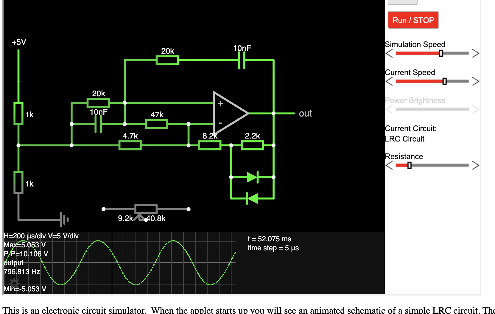
[лінк на falstad](https://www.falstad.com/circuit/circuitjs.html?ctz=DwYwlgTgBAZgvAIgIwKgFwM6IAwDpsEECsqYIiRuAnAMwAsATFUdjQGwDsNVD2AHKhAAjRGzaoADiIR0aqAG4QKqALaYKAUwC0SFAD4AUFCjBoAD0R0+UJBzZQrUBhwap4CbKiXJCCAPSGxqZQFjLWzgwO1jR8dG44XohIvgFGJgDmIZbRsTZIkTFxsAmpQQBKWWE2dlF5rsXI4lAA7u6eUCoAhmbyyqUmzZWOETYM4S7xHv6BA5X545HzTnTtbdNpwaFLvOH8TvyT7d68KTOgc2PL2PvhK4eCSdoCUGC9HvjYKFAY3u3yACaILR4DjYNjEDguMQMGgEcT9YCDLaXBgrUa7Z5rBFIxA7K43G73bGVPGkvZIOhFLFncy4vao66wuhXe5Qbx0UEEdZBHEIJn4-kRIk0i4LKCCiYNI6WTncky0hB4inMmjsGyU1nHQieBEgSqq+zKhw0RYaqUPZBPUhvPAEL4-BJQAE4XCQxj0TlUJB8L0MFAIzr67DMhio42RUNUxBUVSdJIkDpgIFIBPpOM+bVyxEk+l7QUHc3E0KyU3MktOVHCja88uR8NOSXUjYAeSGJorZb410jrIw5CmRcs7ZG5ZNqxKZ157GivHFbAWVaCColBXnDfqazZiD4Jyzy7XI+Hjcdx13CP++rXY-rY9ZKgA9oh-hoYJ0AK4AGzQWYvxfbNCIVdokAu9HwQZ9X0-b9Bxkf9Z1HEDC0nS8Z0ZK9EKbIJ7ygDQADs6VQDAJFxSYzBWVhsE6SQEhmIIJAaL4bUI-s2FwE0kFheg2BNUMkFoLM-HvQxgD8cAIEMIA)

##### Спроба зробити осцилятор з допомогою реальних компонентів
Схему склав, але створити стабільну синусоїду не вийшло. Спробував погратися з режимами осцилографа, підлаштувати тригер на 2.5v, щоб захопити перехідний процес ввімкнення живлення, але при вкюченні не спостерігав натяку на крихітну синусоїду. При спрацюванні тигера на вимкненні, щось подібне до синусоїди відслідковується але я дуже невпевнений що я бачу саме її.

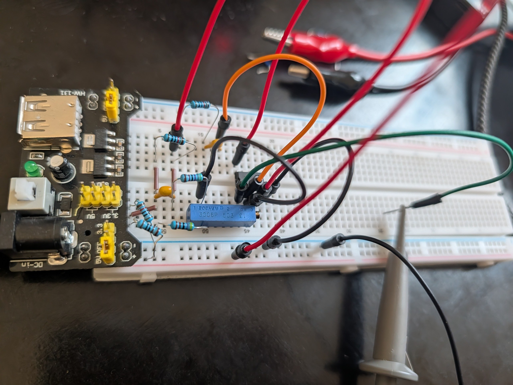
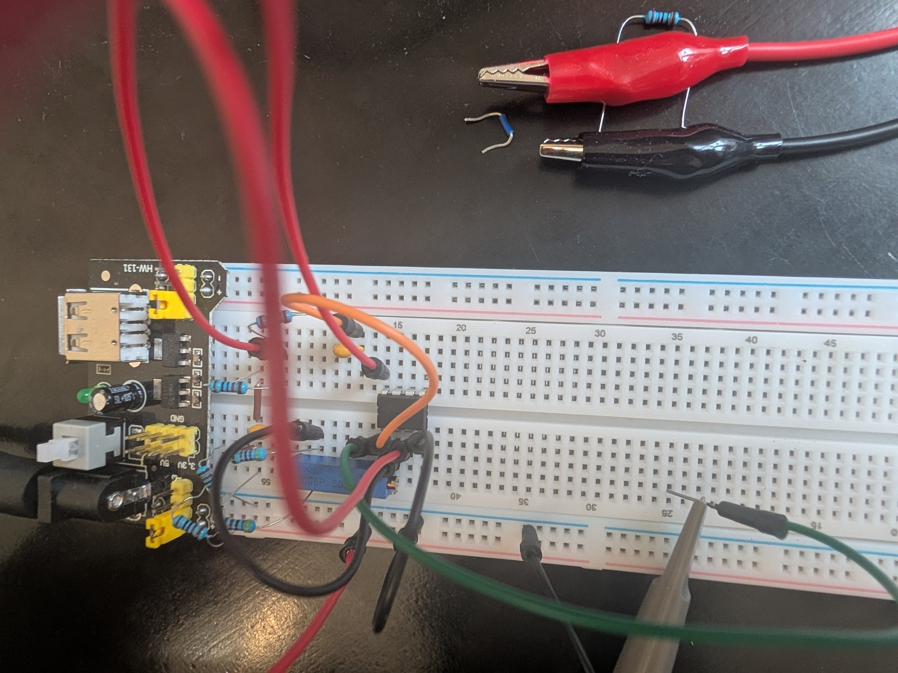
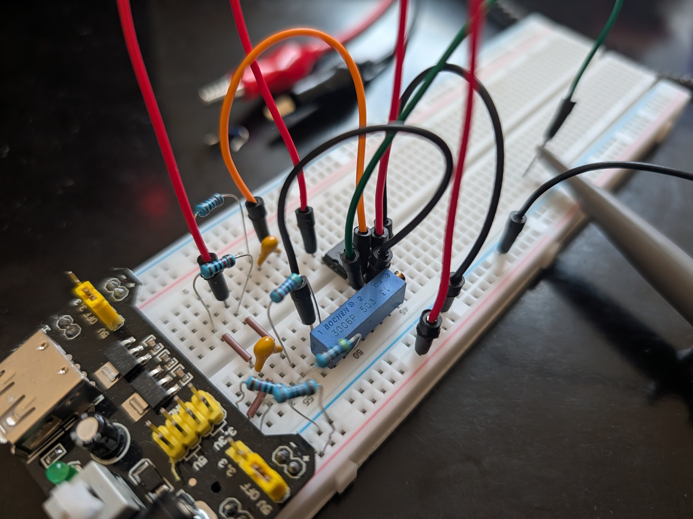
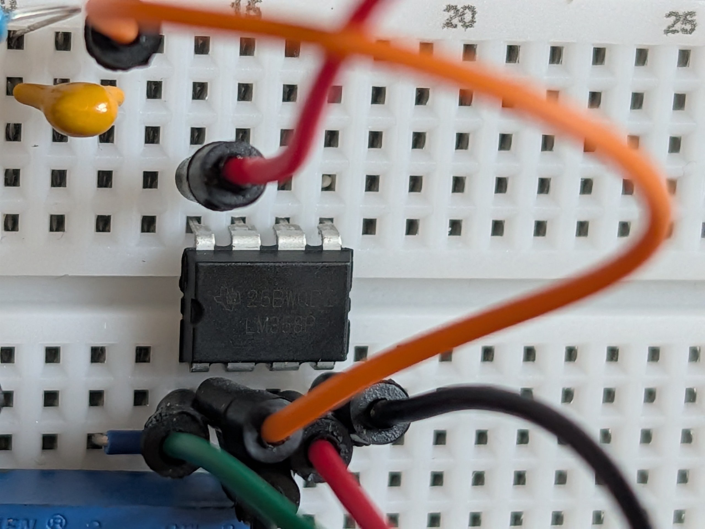
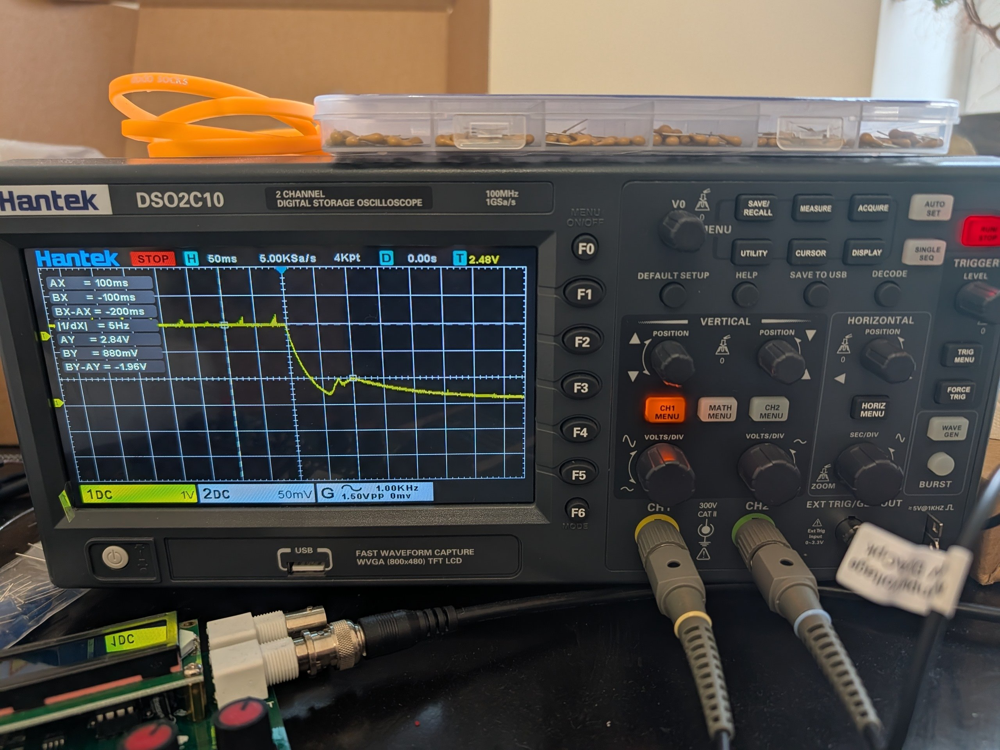
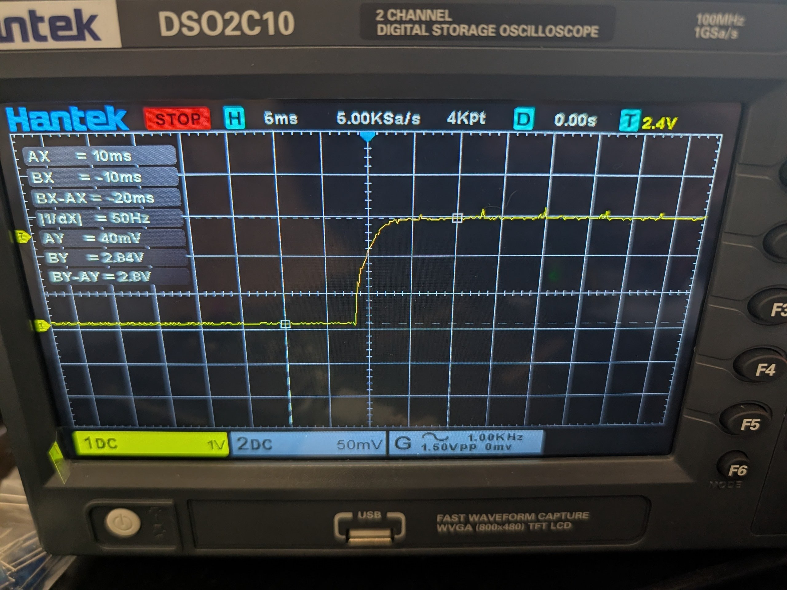

