# Lab7

### Завдання 1. ЦАП на основі PWM-генератора та RC low-pass фільтра

R = 1 кОм
C = 1 мкФ
Duty cycle: 50%

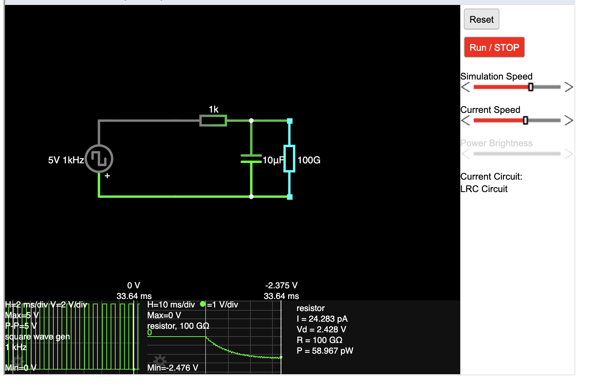
[лінк на falstad](https://www.falstad.com/circuit/circuitjs.html?ctz=DwYwlgTgBAZgvAIgIwKgFwM6IAwDpsEECsqYIiSuALAMwCcSDAbNnUUlXQBx02ogAjRETqoADkIS1UANwjDUAW0zCApgFokKAHwAoKFGAyoADwpUqUJAHYmVi1ABM1x6njImqAO7vXseciESgCGJjKIjrgkUAJgwVgIkSQA9HoGwF6m5pY2do5U2Fa2bjgIqfqGmWbIDs6OTgVOLiUI2GVphtDV+YW5UDQ0drktbVABSEHl6VURjXX9g01+7m1TlVkIA0O2-Vw5xbClaxkbW0u7lnUj7RXAXYg0e0V2j5fNh62o44Q-PzfpIFOiz6ZyuH1G5Fa+B+dFhcPhCNEUDA4ShBBQUAwAVGMgAJoh1JEqFwCNZrBNsDYiNhrHxjgB7KCqAB2pUxYgong+JgKjho2GC4lKHXSYigqNGGEhKRFhjFqL4mMheEIKGOyXpHWAjJZiGsqAwHIQTCoLRMLD5SEFUCNOgqovFbKlESiTCQXDJVDqTGsJN9SgSGMURtWsuA8oeBuV0MpAZwMewnERyboXODRy1Gr0wGS4AgeiAA)

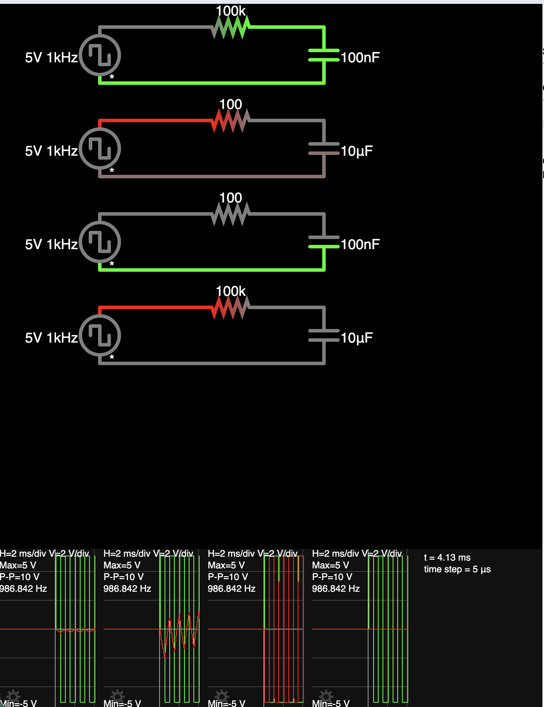
[лінк на falstad](https://www.falstad.com/circuit/circuitjs.html?ctz=DwYwlgTgBAZgvAIgIwKgFwM6IAwDpsEECsqYIOuAHAOwBMAnEgMyVMBsTd2zTqIARomqVUAB0EIALLygA3CIhJQAtpkUBTALRIUAPgBQUKMFlQAHoh20o2KFaiSRsS21QB3eAlqoYC5IVRlAEMzWUUEAHoDI2A3c0ska1skajYbHxxI6OM4i2REh0ooWmwixwyEbCzDY2g8lLTbWjp050rUPyRCAmqY3MQSsqKmbElCiqqomtB4hBGx23nxtqqocmQtalIwyvxuVAw-VdkAE0RNPGxaJCJJIhTJWkpJJDZKZklenNnmpKgl1aeSbZWI-FqURajKAQiZfGZ5JYQ-5QxJOIF8CjdbD0HG4vH4+jbTH7KCHTJyM67RxMIjYOhISjvV7YIgcOH9LylOxPZFjVGwqYxOqWVLQprgwHkzo9QXfeoFVHFLn8lbs2b2JENMUCkGmeXWTUKp4VV7uTzeWDSnoqEI7Eiy0F5X52NiQvmunXTECzJbM3lKtHk9ZIPZYsMEJCbIntUlHVCnc6SXB4tglegMSTp+ifB0cwYB-2DT1C9Wiv3O5mwqBWtX6gv5ouq3PqhWuuxlj1N3Ut6x++yNzymqAeAY+K2rYKhcLNp0tWiSN3FBfF4zehFQ+eLp6BmPrS7dAmH3HR1ZkmMJhAXUMceclbjXaiSNiPLYzgZc7eFxkr4DC5CizdijnZdVWrSwsVrBJrE-Btvy7aYOX7Bd2zSTcfz1KCl2SAptxNVxh3NMdwOtSc7ThAB7KB1AAO3JDBRBcCozAXWgRiCMRMmyGJRDkOj1ntLjjB49Rwl4mMMH4uEInIkFKJoywZHoxi2mYq42I45AEEE4AeJ2U9JNlbiqMQJw9IOAyQWk2SqNozkDgY5B8M8VTWOwdioAc7xtN0vjp284zkCUMzSQs6YrOmOTbOaezlOclj1I8xBeH84KJL8mojJErwLVS0KYnC4AInACADCAA)

100 кОм + 100 нФ (104)
непогане згладження pwm, незначні пульсації, конденсатор заряджається дуже швидко
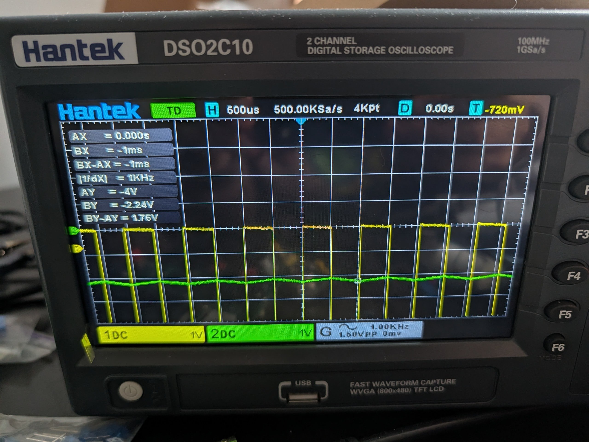

100 Ом + 10 мкФ (106)
згладження pwm на реальній схемі -- ???, пилкоподібний сигнал через великі пульсації
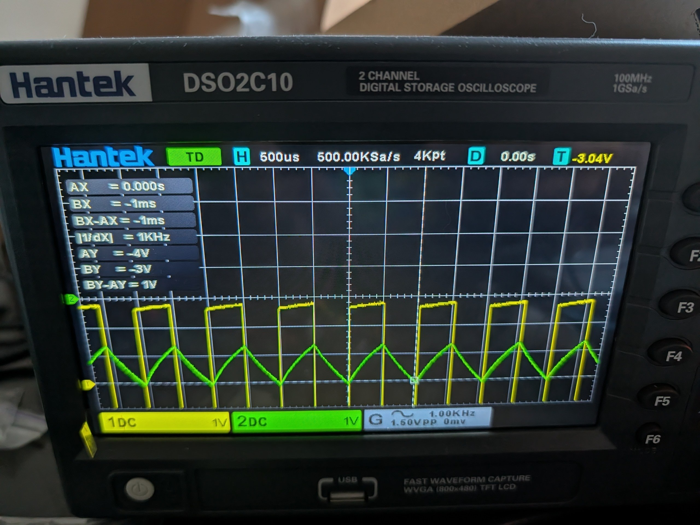

100 Ом + 100 нФ (104)
миттєвий перехідний процес, відсутнє зглажування, по суті маємо pwm сигнал але зміщений по Y
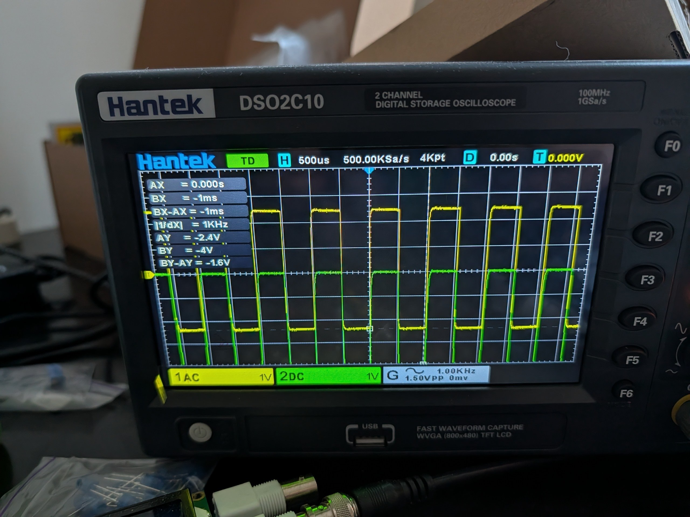

100 кОм + 10 мкФ (106)
пульсації не помічені, конденсатор заряджається повільно тому перехідний процес системи довгий
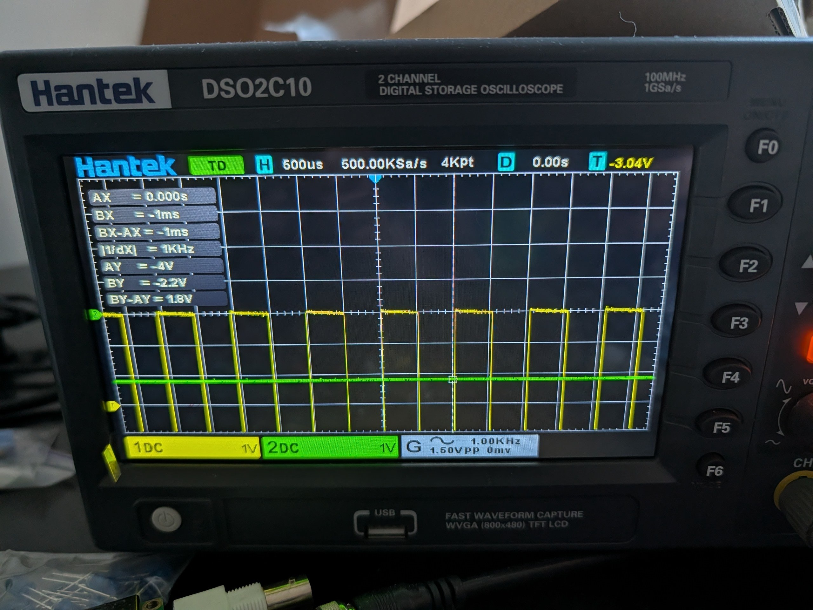

### Просимулювати архітектуру флеш-АЦП
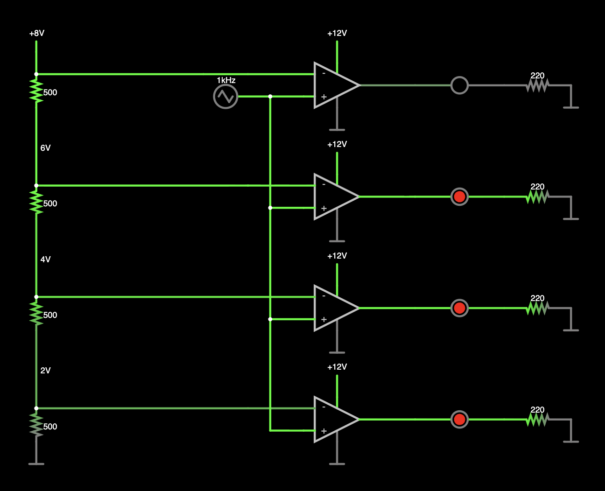

##### Дослідіть як частота трикутної вейформи впливає на схему:

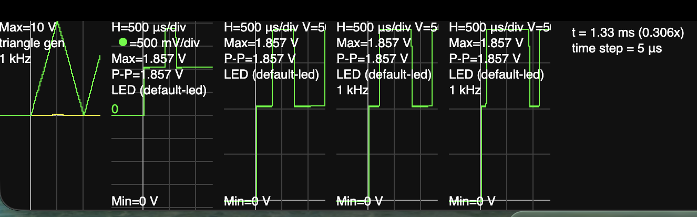

Чим більша частота - тим швидше миготять діоди (один семпл буде тим більше розтягнутий по часу чим менша частота, по суті описав очевидну річ).
Як бачимо з віртуального осцилографа, кожен діод буде горіти стільки багато часу, скільки часу напруга на трикутній вейвформі задовольняє умови "вікна" напруги поточного каскаду. Наприклад пік вейвформи задовольняє умови усіх каскадів - усі діоди горять. Але через те що вейвформа трикутна, верхній каскад буде видавати 1 найменше часу - допоки пік підпадає під проміжок 8-10v

##### Додайте ще два аналогічних каскади, щоб збільшити розрядність АЦП:
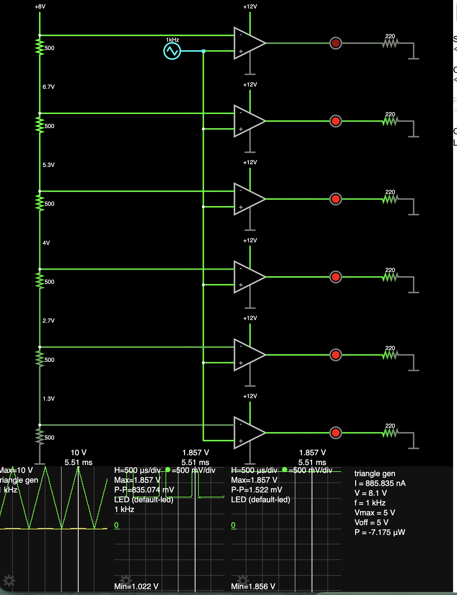
При тих самий значеннях напруг і додаванні двох каскадів методом copy/paste (чудово що нічого не потрібно підлаштовувати), маємо більшу розрядність. Але з розрядністю маємо вужчий діапазон напруг на кожен біт, тобто АЦП стає більш чуттєвим до напруги.

##### Інвертуйте логіку роботи АЦП

Можна змінити полярність входів в компараторах

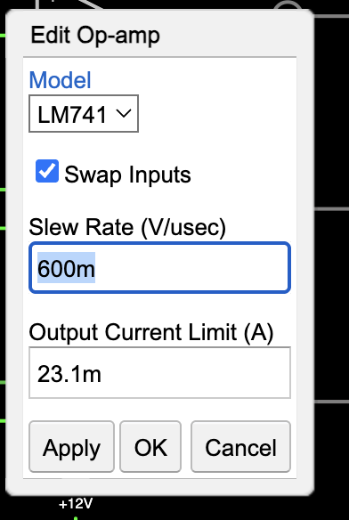

На практиці це б значило що ми підʼєднуємо входи генератора трикутної вейформи на мінусовий вхід замість плюсового. Це дало б змогу нам заощадити на компонентах -- непотрібно було б використовувати окремий інвертор, або купляти компаратор іншого виду.

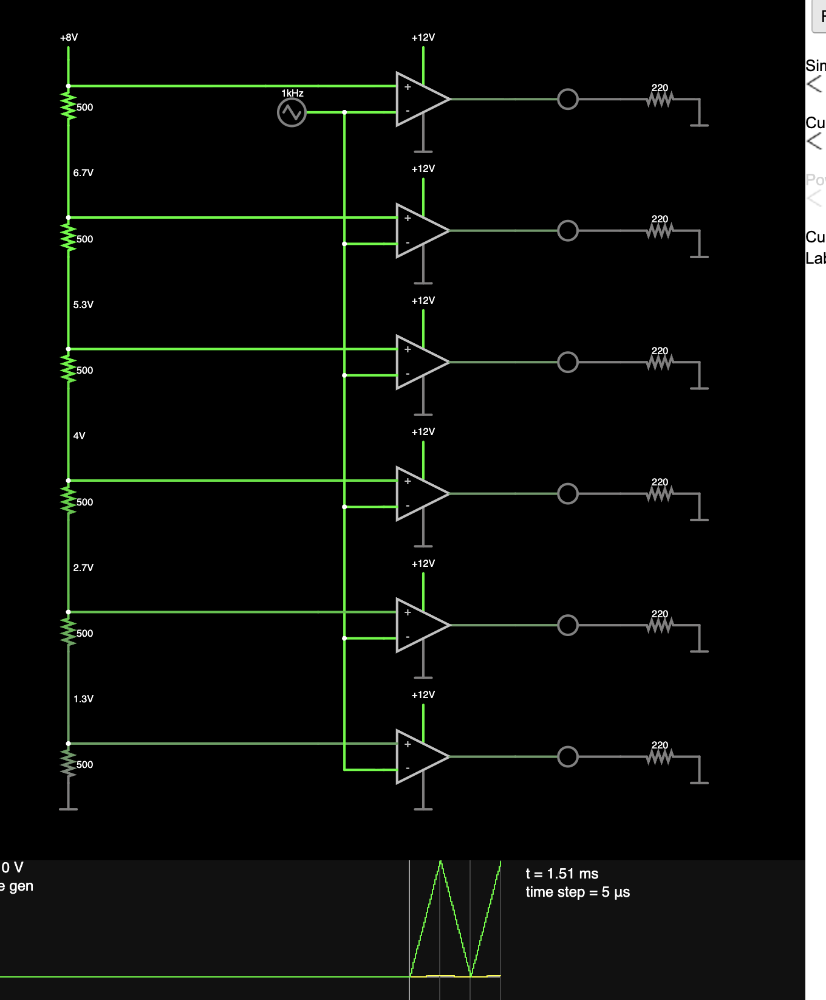
