# Lab8

### Просимулювати логічні оператори

[link to falstad](https://www.falstad.com/circuit/circuitjs.html?ctz=DwYwlgTgBAZgvAIgIwKgFwM6IAwDpsEECsqYIiSeATAVQOx0DM2AHFQGwCcndqIARoiLZUAB0EIALI1QA3CENQBbTEICmAWiQoAfACgoUYAEEAdgBMoAD0QbGVKO0lQW2R5NTwEIgPT7DwBjWtkicDpIsUHbhLJ44YhQIfgZGQTYIWmEubtHZcd4JyEn+RgBKwRmhMVFUVM4R+UjsqADuXiJQSgCGVrKKyQHl6ZkOrjV1ebAUzVBt8Z09fQgkA0YAMgCiACIVY05QNJFO+R1KAPaI5mowXQCuADZoGvdq5nwKRVAgAObzAvNKfjkbz4FCrYDQdKHdxQexuY5TApQD6UAjFFLAb4VOEwnHaKgndEBLHpPFZHF1DrtIlGSGIaFVWE0KBVQnIiiEGnATY7dJjRkMsJs86Xa53R7PV7vRJfX5I-5IwHAvDYMElYBDEJZaEaWrOQ6NGZzRWLfrqzWVLJIOjscbOa0zLxNVrUha9M0YtJahw6+wHVhs0SJcFey0OB1RP0OwPB9UAeTpGSjWX5QsRvnVJMQOJzzMY7Fi6a5iehubccLZKM54J5u3LzNLNGFFwQVxuDyeLzeXxRfDlHQVpyBOFBXItI1h2GcuomzA8iOds1d3Xdyy5oYnc8jDjnhPBZkswz9OLGFaLIYqdhYzkY+btsPze-VAElL3qH7bcrfHfMMPcRyQUAABZgB6gyXow14flEkhNB+hougCpprskwA+OAED6EAA)

AND gate

| Вхід 1 | Вхід 2 | Вихід |
|--------|--------|-------|
| 0      | 0      | 0     |
| 1      | 0      | 0     |
| 0      | 1      | 0     |
| 1      | 1      | 1     |

OR gate

| Вхід 1 | Вхід 2 | Вихід |
|--------|--------|-------|
| 0      | 0      | 0     |
| 1      | 0      | 1     |
| 0      | 1      | 1     |
| 1      | 1      | 1     |

AND-NOT gate

| Вхід 1 | Вхід 2 | Вихід |
|--------|--------|-------|
| 0      | 0      | 0     |
| 1      | 0      | 1     |
| 0      | 1      | 0     |
| 1      | 1      | 0     |

##### Опціонально: Складіть схему XOR самостійно
вимкнено:
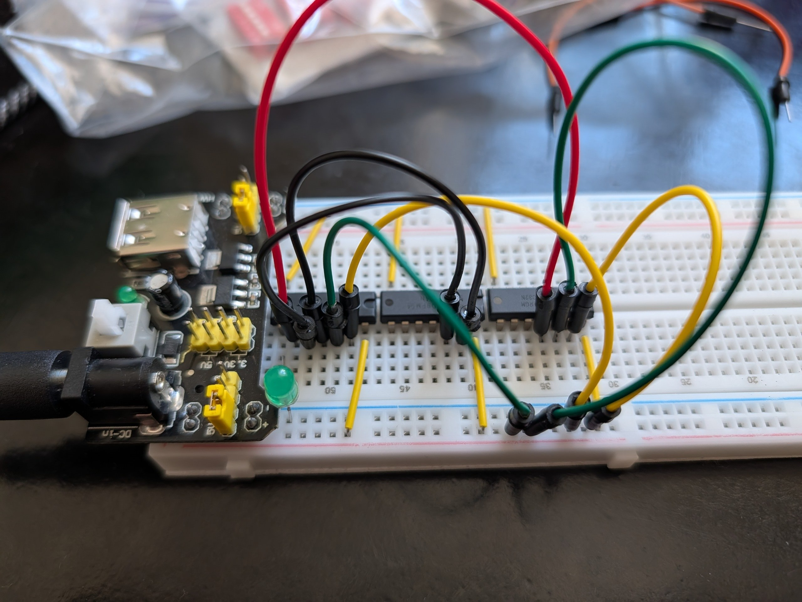

A*!B:
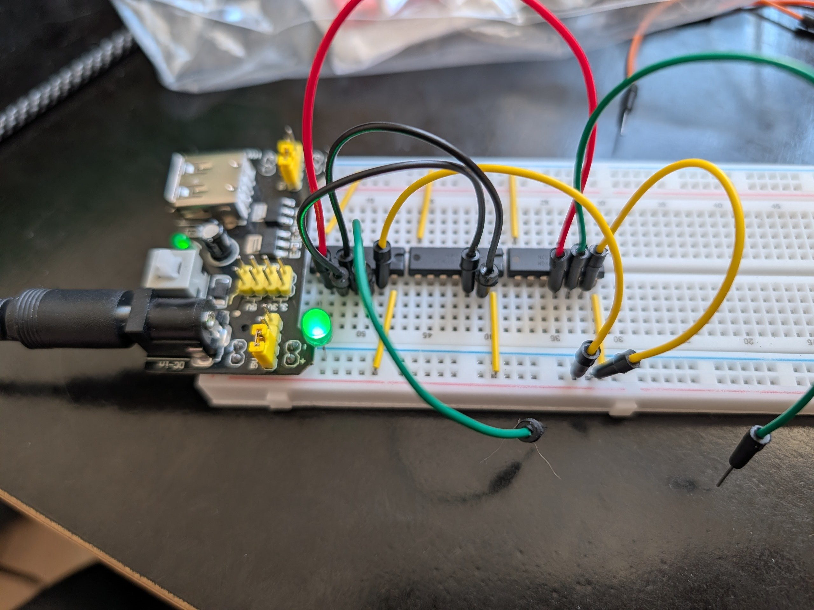

!A*B:
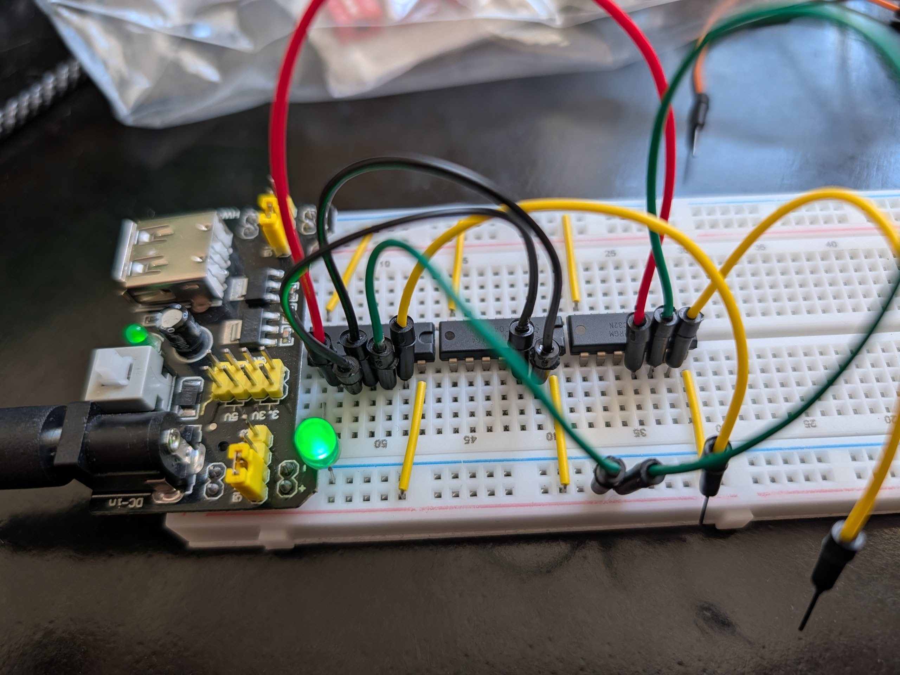

A*B:
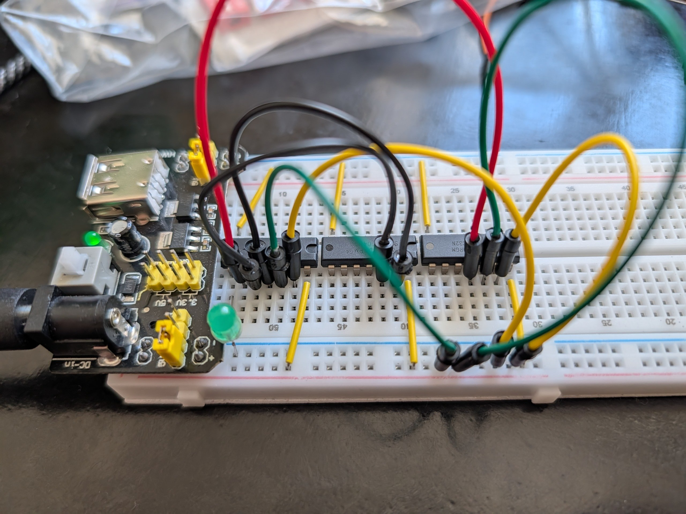

Всі мої знайомі, дуже хороші люди, вони всі говорять, ці хороші люди, що це кращий в світі XOR, ніхто не робить XOR так гарно як роблю XOR я. Ліберали говорять мені, що існує XOR 74AHC1G86, а я кажу FAKE NEWS! Мої добрі друзі з Texas Instruments говорять купляти OR, NOT та AND на окремих чіпах на 14 пінів, всі так роблять. :)

### Просимулювати таймер на базі 555

[link to falstad](https://www.falstad.com/circuit/circuitjs.html?ctz=DwYwlgTgBAZgvAIgIwKgFwM6IAwDpsEECsqYIiAHAJz4DMVAbLUlQOwBM72ttALKiABGiItlQAHYQl61UANwgjUAW0wiApgFokKAHwAoKFGAAVMMvXQAHok3sKFKEntRtVdk-up4CBggD0BkbA1ra0XFAU2K7h0UgMYrA4qIrIhAQBQcahCJq0FLyR0XkFTgneyVCpSOmZhsYYUDa5+YXsHDGltAwUFQiJ4ogogfXAAO5NtpyFUa7TUIx9YiPBE815EfHF9o5bS3XBIJO58ztz7IXdvUn9AkNa12ByOPjYKFAYqYlyACaIfitjGtbCwPGc3B5eBkbsssuNjiVLj1OoUoYkfLDRsCWqVePEYhE8X4YQcgQj5rNtLwZujkoD4estmVikhqcz9vTsVTCkzuUUOXCAErki5Fc6o64+eKoMYYlQAQyszwQVFJIQRTNBrlmoP2VUQnExwQAMgBRAAiCJ17jKTnceuUAHtED91DB5QBXAA2aE0XvUPwE1QEAHNKkJKspBOR+vhhnDsfitfi0QKsRqbWjbamSZyRaiCOKoFc08EQwjYlAiQTotTJXSExXcfjEVXoXK84zMy2tTmO431vMs3ZRUTS2T1q0oPM7A5pxdxwywqVeVPpouuWvRa32uwN+S5+wiAwa9Pj-vJ5sEqej8T++nL9Fb6faNh+LmByDuyeR6jpR+HymUcW0rMcAMOCsIlfQoNlrf85SgGM8HSThSGVZC3lQT5Kl+F5CGoKgqBqAgCKIpAKABT8TlFSlKyiC8wgiWjSnogDgH8cAIAMIA)

Дослідіть роботу такої схеми(R(dis)=~40k Ohm):

Додаємо scope view до перемикача та світлодіода. Бачимо наступне - якщо ввімкнути перемикач то діод починає світити одразу, але якщо вимкнути його раніше за 1 сек (R=40k) то діод продовжить світити. Якщо ж вимкнути перемикач запізно -- діод одразу гасне -- має значення саме момент коли ми ввімкнули перемикач, від нього починається відлік часу до затухання led.

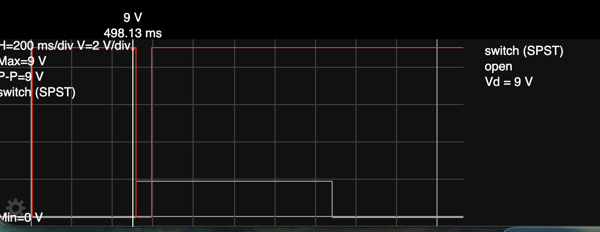

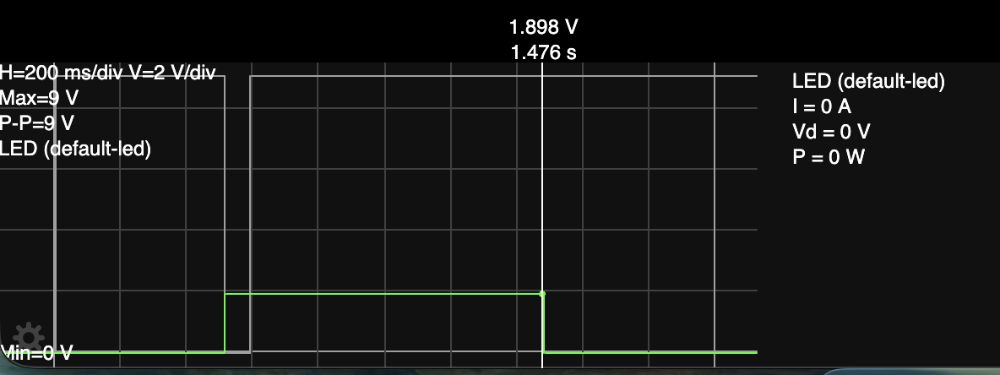

Підберіть R та C так, щоб затримка становила 1 с/5 с/10с:
R = 40k, C=22uF ~= 1с (графік вище)

R = 40k, C=115uF ~= 5с (страртуємо з ввімкненим перемикачем, одразу вимикаємо його)
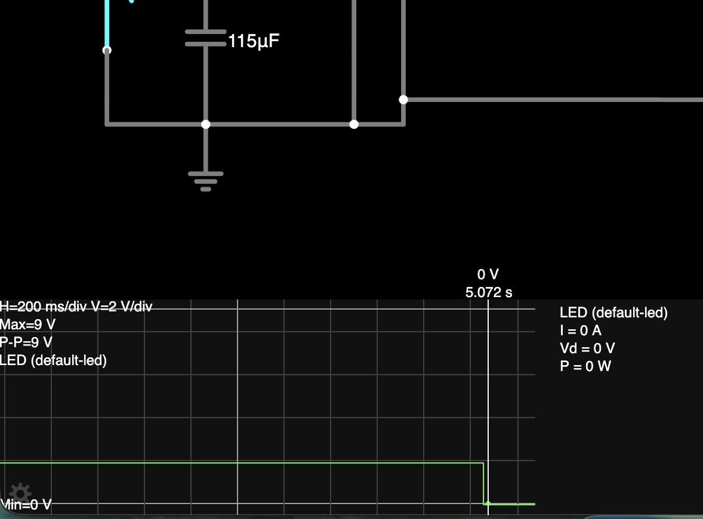

R = 80k, C=10uF ~= 10с  (страртуємо з ввімкненим перемикачем, одразу вимикаємо його)
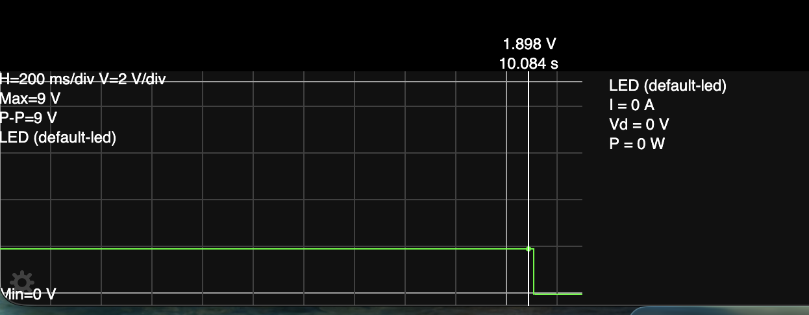

Також дослідіть, яку мінімальну ненульову затримку можна отримати у симуляції.

Методом підбору вдалося вхопити затримку в 0.01-0.02ms при значені C= 350nF

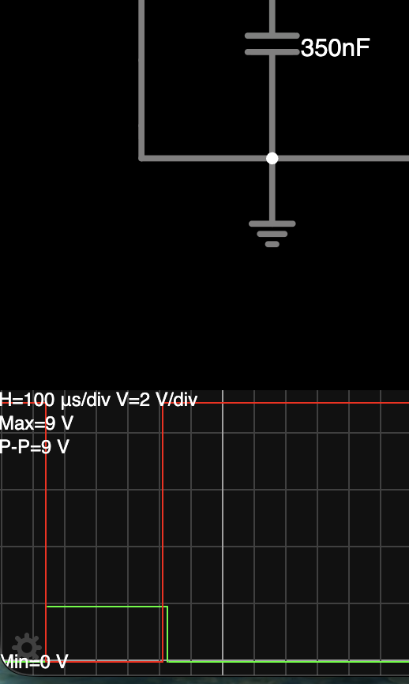

### Додаткове завдання: PWM на NE555

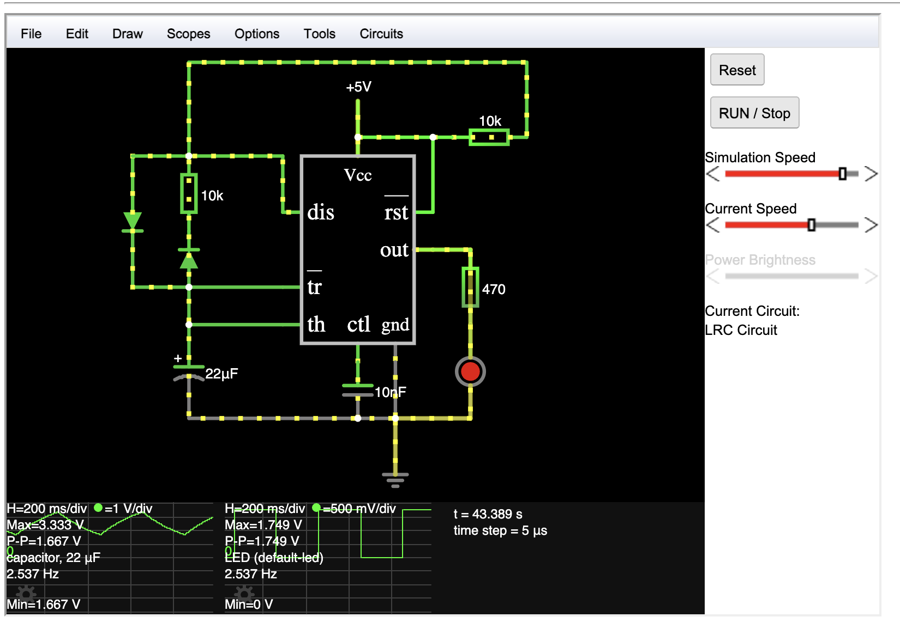
[link to falstad](https://www.falstad.com/circuit/circuitjs.html?ctz=DwYwlgTgBAZgvAIgIwKgFwM6IAwDpsEECsqYIiSBuAHAJxFIBMTAzNrQCxIDsJUIAI0QA2DqgAOQhBxaoAbhER8AtpiUBTALRIUAPgBQUKMAAqYZeugAPRIw7YoTalEbVnT1PATD5RRB1xaWjZaYSJaJGFhaiRqRgQAegMjYAAlKBsENg4oUKhsqA5qTwofKAB3L2xUZQBDKzklROTjcozEAryWaNyyqubDVvasnsiHbudQkoRqpMHgaw7qHLyOIt7p6qhFZEJZluA2zIne-OWN2BwBlKP-ddX1lnjLmeuhzLXnJ8dhcef+uY3YZjfKMH4OHT-K6A962eyOJjghFQ14w4AAE2BiMhyJcdk2NQA9hQAHJcIpvDHA354nIgnh9K5QZTE5BkpAUtGLZA0hlIyEE7YUPaU27IbHY3lMAlosU4xh2JEKsQvfbzMV2BzKpX41Wi4aalxEYRK40yg5ymmMY06lUAi0G+Hyp2-c3q4YnJC0MH2CHet0pbm+xzewoEI2M15C6TcNUpAAyAFEACLDYPWk3BljdQUsxDo9QwWoAVwANmhNKX1OjUCAdih+ABzJmCJnKATkGb4FCyj3dFxufL97ORuOw6ThkdDk0jgPjqcL7A5Wd63vHJfTpEr+3zEAejeuL4b7ctihaYpQMCNLsEBsYHZbOTojq4bNv98f2iU8R7zIgjNbjmer8Dg+CEAqpDXngt6oPebbXg2T62LgwixtQRAyN6wTcByvCUo2fYzsOw7LHOwCElA6gAHa2NwsHiMKupeFYvyMCwSC1BIVwtCk4hQFBsGdiwr7ZhwnDhNwwhehmsjMlgyA1AxqI8cYfHXrJGCdtBMFyaBexiUEhlGcZZTKEpY7AAkhIHBR1G2HeSmUExiAsdgbEcVxCkqcAalMppFC4NwRRiRwqFEDhLDcNQQU1PJeAqOZby8fxHSCXpOnKHFYEEAZxl5UEpmJWiVkGJZ4AQAYQA)

За допомогою резисторів R1 та R2 і конденсатора C1 регулюйте частоту та duty cycle

Якщо збільшити номінал конденсатора між th та землею, зменшиться частота, якщо зменшити - частота зросте. Так само з резисторами попарно.

Міняючи тільки один з резисторів отримуємо керування duty cycle нашого pwm. На скріншоті видно як зменшився duty cycle при зменшенні R1 до 5k/

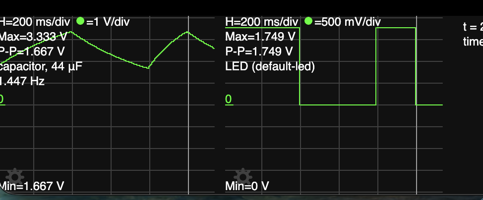

Скріншоти схеми із різним duty cycle (25%, 50%, 75%):

25%. x/x+y=0.25 Візьмемо один з резисторів 10к:
10k/10k+R2=0.25
0.25*(10k + R2) = 10k
250 + 0.25*R2 = 10k
0.25*R2 = 750
R2=750/0.25=30k Ohm

10k/10000 +0.25y = 1 -> 250/250 + y =0.25

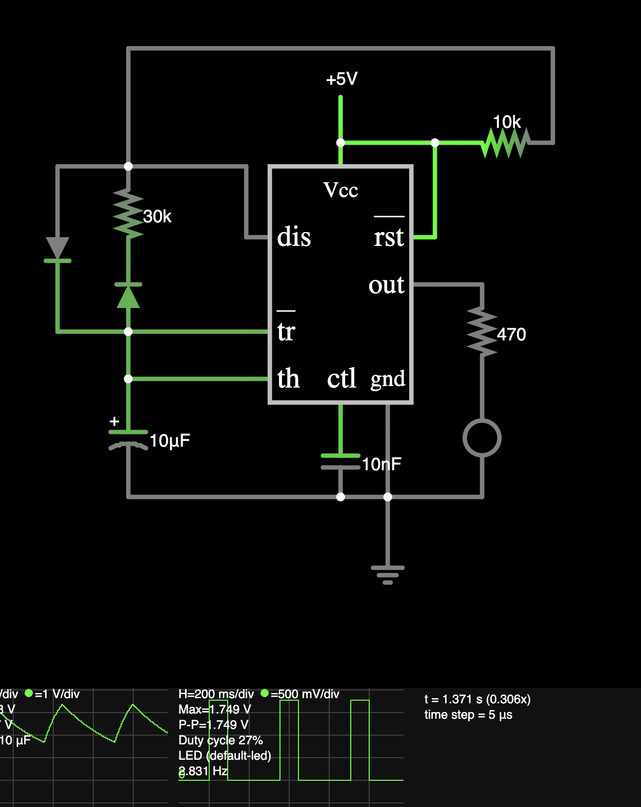

підлаштуємо трохи резистор 10->9K Ohm:

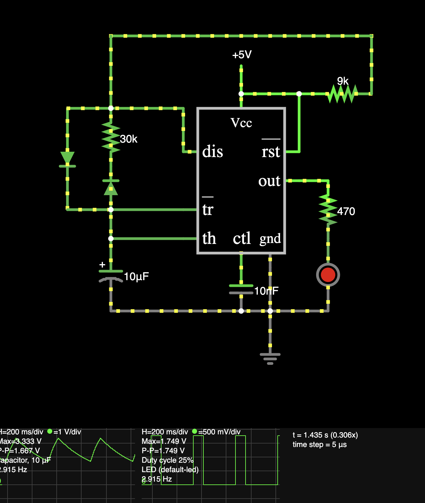

75%. - міняємо резистори місцями:
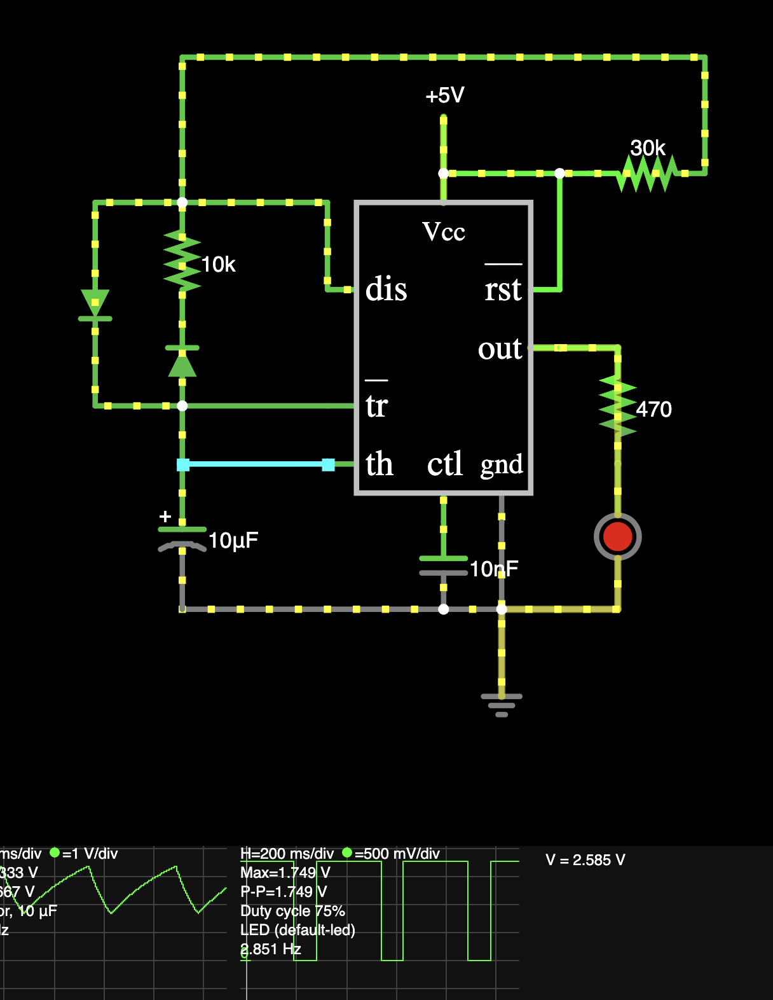

### Додаткове завдання :

[link to falstad](https://www.falstad.com/circuit/circuitjs.html?ctz=DwYwlgTgBAZgvAIgIwKgFwM6IAwDpsEECsqYIiAzABwBMuA7AGw1G1IAsFAnF9o+6hAAjRP1QAHEQk6oAbhEQkoAW0yKApgFokKAHwAoKFGAAVMMvXQAHohrtsUJDSpRnLp1VTwEjOUUTsuDxc9OxUXGE0TjokAPQGRsAASlA2CBTY7FBcjFAZWWFeiEi+UADu3tioygCGVrKKCPGGxmWplJnZuRSMLjlFCFXNiW1pPe6MDuNdA0MJxtaUVFk5UOxhM7A4qArIhHMtwKOUvV15y5uVTfNH7dIbq+suFDSz14fH9880jpN5r1tBu8RncSlMfmDHE43sNWnc7A4dBC-kiYTcACagpxQiHYmh2N4qAD2xQAcuwOJ5YcBMWlIfispCkExCcoSchyZTgQtQSimL9EdDAVUoLskPtubc6dikQKcWiPlifgy5QyFSC0gjXHZVQThZLPlqWLl6URSldqZ9TSa-mr9Zb4fYca4nWD1XCxqckFwfvZET73VLKD1XFRniGKD1A59I90I51Y9G7vk8iHIYn7TcQMnOm48gmo-qoORkFpPFAwA1BvhsCgoBhdiLZOjKLhI+2O53fNTxNm6bazXKM1dizga4RgpOp5PSFW8AQ6w3tioq3Xm7ZcEQKURsDR6BQdJx7DRuzcAObJiNX7rLQOLaQERw+taP42EsUS6kAeTunGVg7CBwaGwcsRwwEsDg1AJXwAl5XDNQMfzSP0n19DYOAEItwO2B1kMfWNUzjc0cKzX8YNyFDh2XCDxwoWcxwXVAlyBKB1wQOgwh9A8+C4cZ6GcSUiSgdQADtbHoJjxGKXdMO8KxjwyGoJG2eZEnEVjl2w6Qgh4egiBeZYqFrLcWG5NThNsLg5E0ktAmCPSDMApATLiG5YiJAxgFicAIAMIA)

Початкова схема
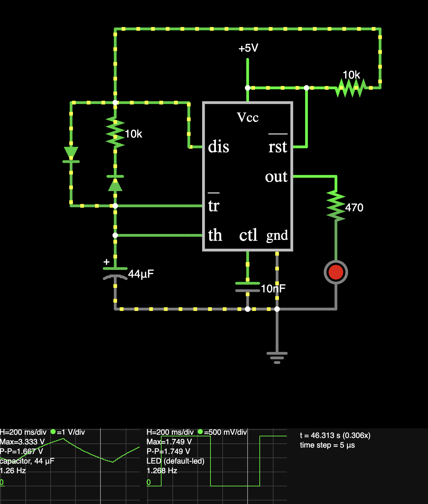

Реальні компоненти:

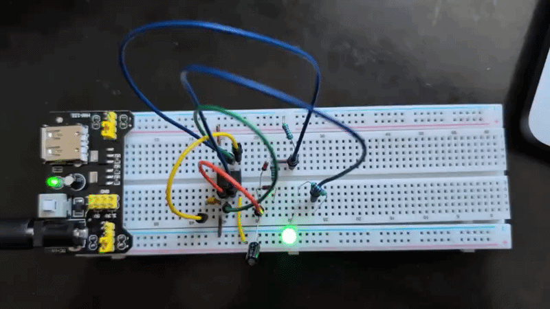

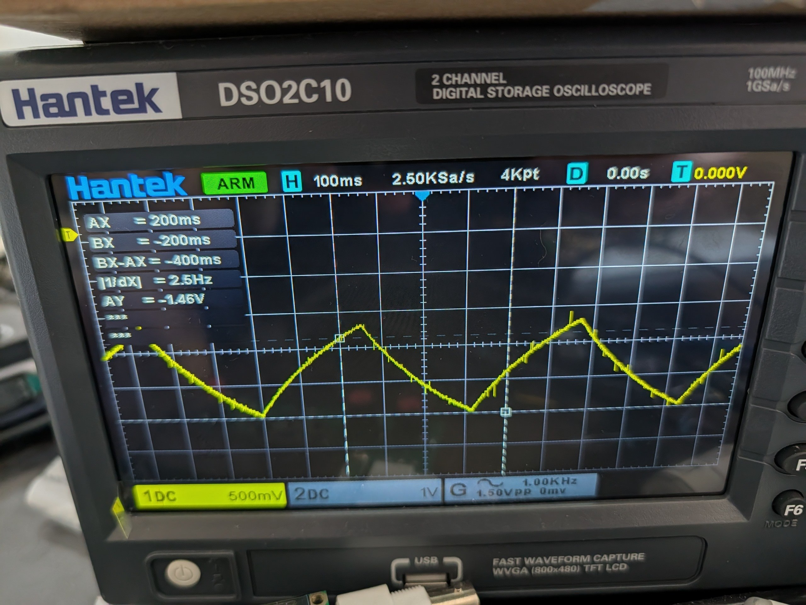

Duty cycle: (зробив вище на схемі вище)

ЦАП 🐐
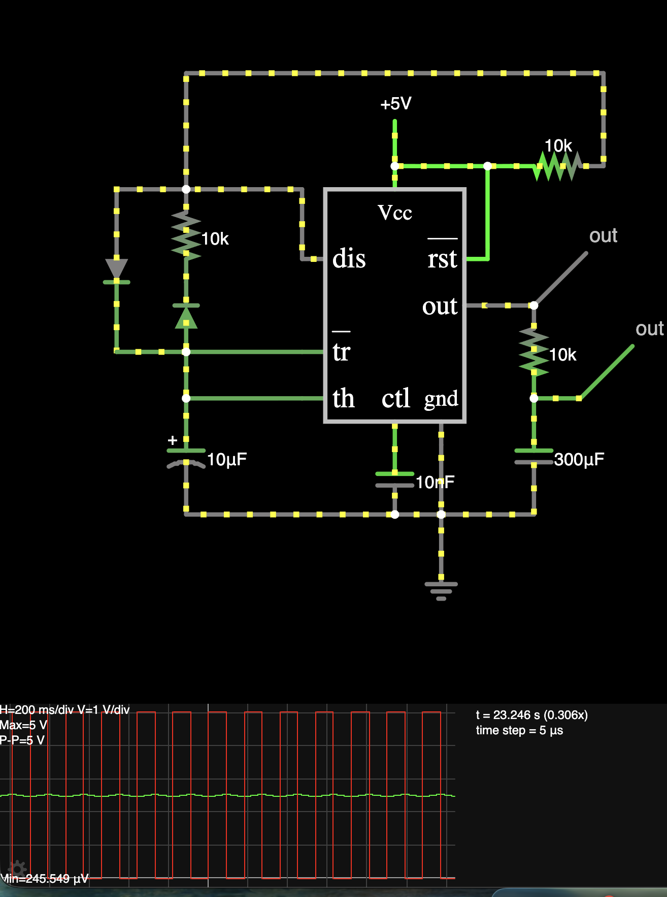
