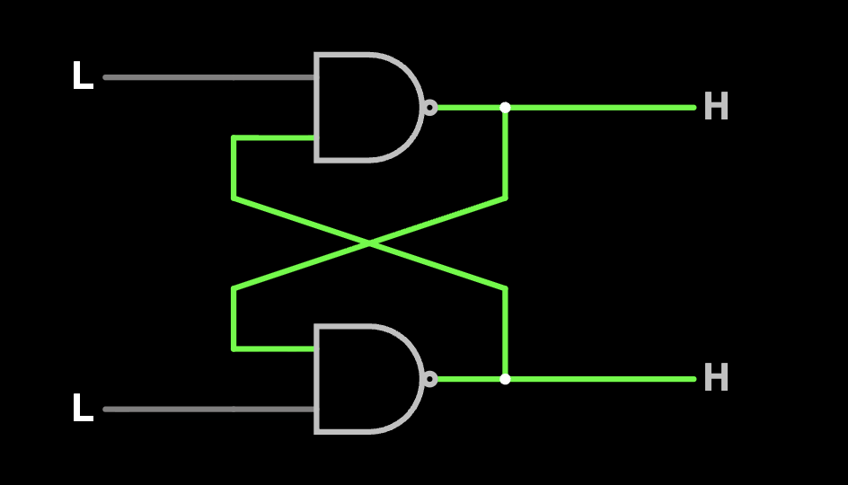
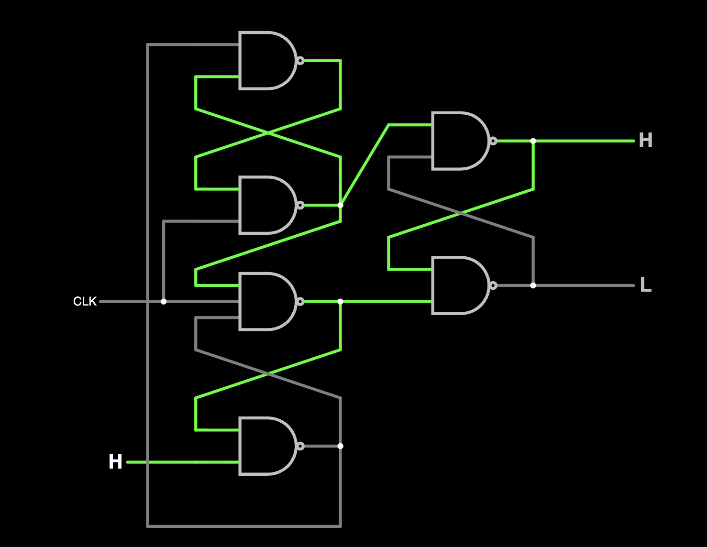
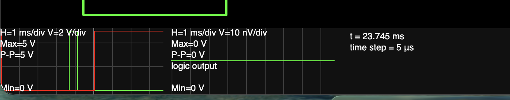
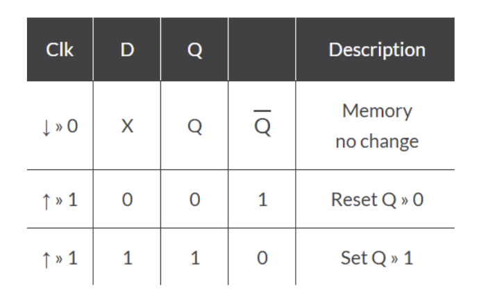
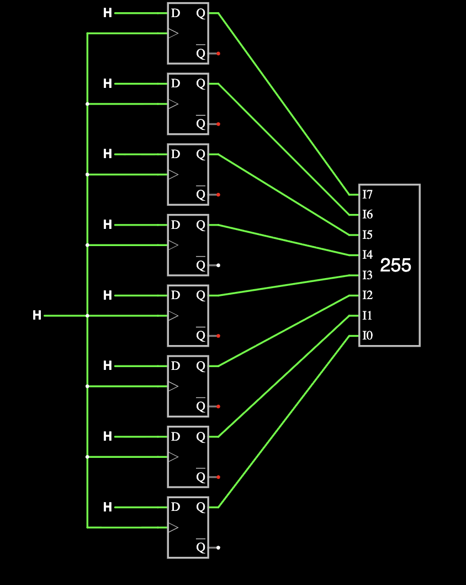
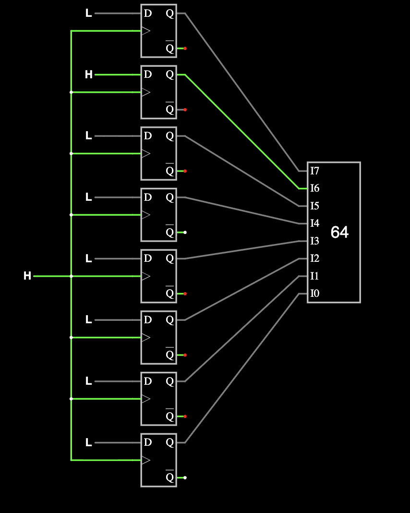
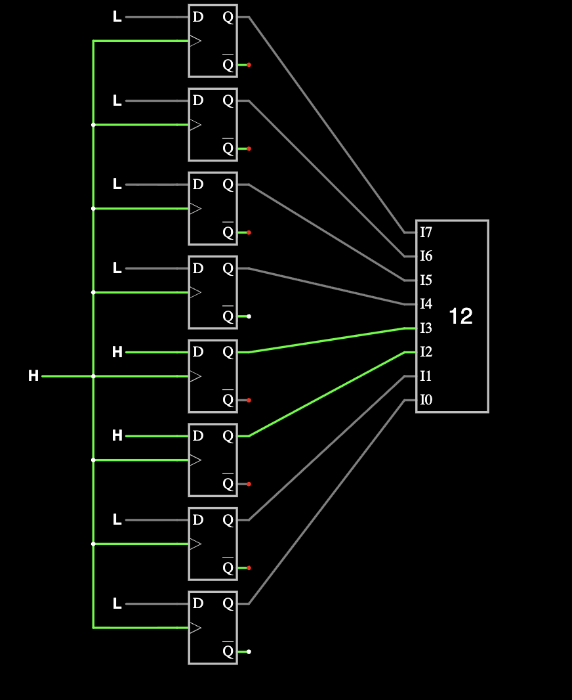
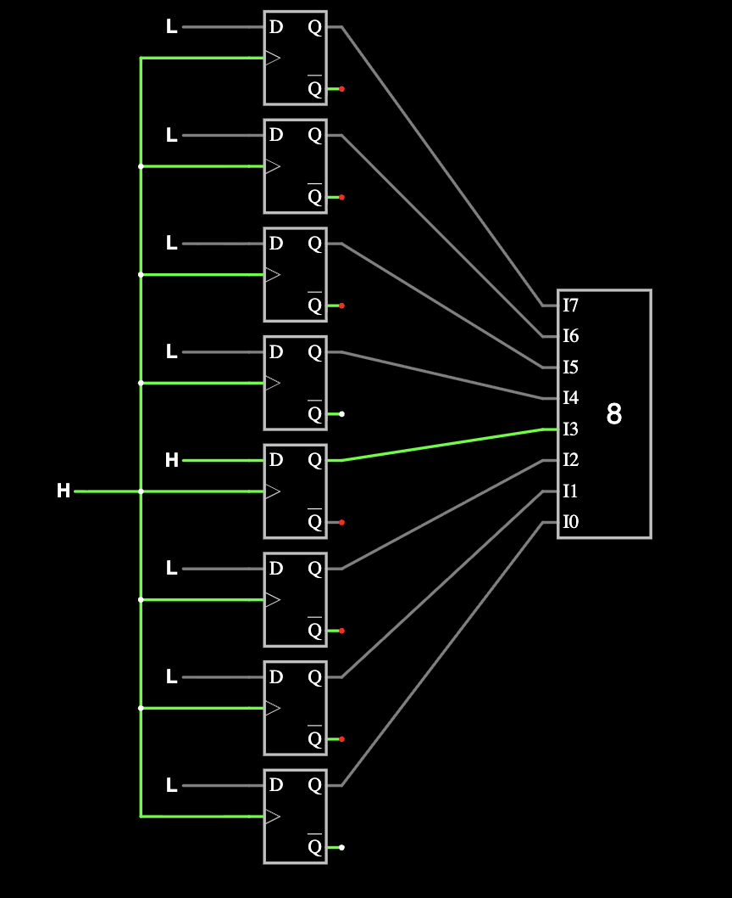
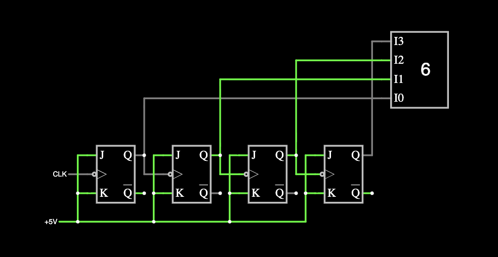

# La9

### Послідовна логіка, пам’ять і стани

##### Просимулювати такі схеми

[link to falstad](https://www.falstad.com/circuit/circuitjs.html?ctz=DwYwlgTgBAZgvAIgIwKgFwM6IAwDpsEECsqYIiSeATAVQOx0DM2AHFQGwCcndqIARoiLZUAB0EJhqAG4QhqALaYhAUwC0SFAD4AUFCjAAMlAAeFKiygAWSzestU8BCID0u-cACypxPSpQaS0YWKwDWRxwENz0DADkAQwA7ABMfZAsodlC-TKsI51QAe3lojwSUtKQMwIC6f0D8kShiySj3A2MzdMsqKlC7XrzYSNKDAHdKjKROfyrLJHYmp1d24AmuuagWbChNzSpGtpi1tJyanIWlkdX13zrc2tmqw9GTjamqx93Fl5vJ+cWX32v2O3i6OSyUGCoSyII8ACV-lAiHR2PZkaj8kheFAxk4DrA5MgCIp4iZpL5cCQoPwwPEsAgqFSjh5bshAVZGP5mKFoXDxpVAdCodh+lz+W9EDyoYw0dK+cMCq82dKbDtVeLFStjmzLlCiLMhSEJbqOZC9ZyCcsWXEkqkNhztiL+tsJeV7RQhbLnTL2IdmiU-g6dux7tL2H0TYKQ30faGrdcdWlpSi5aLMpGtTbJQhpXV1en41Hg8iZt8Y0Nrcro1A6Om9UWs69Op6dkw0U72-7RBRs+6a-mffm3Xaa6mfan-WBElKioGk108zQfdsrkqg1L06vdp9V8WKLuCDvuTR98hPlydnrL2e9URAXerJXE6zk+m1T6rJw-U2N+ydkQT6ft+t4ZOOmxfj+VZ-hB37ltYIG-gurYYmimyTkhHhgogkHWAsmSsHhUEvgKi4Gsiny4VYsKYaRUrkdR-RwUQzy0TmVH4VRNHQchCC4feOz8axPFlKOZH+AJCFogJI4VOJRFSUR-otCQrzYXxzGAoslgyWxKrpuOjDkRhIl0bmxlAUZEnCSROZWdYkL2ZaZ5OUeqqukhwAuOAEC6EAA)

Перша схема - NAND SR-LATCH

| !S | !R | Q      | !Q      | Режим роботи    |
|:---|:---|:-------|:--------|:----------------|
| 1  | 1  | Q(t-1) | !Q(t-1) | попередній стан |
| 0  | 1  | 1      | 0       | Set             |
| 1  | 0  | 0      | 1       | Reset           |
| 0  | 0  | 1      | 1       | invalid state   |

Друга схема - Gated SR Flip-flop. Має вхід для синхронізації, запамʼятовує попередній стан + міняє на наступний лише при фронті синхонізуючого сигналу.

на осцилограмі видно що відбулося перемикання логічного входу в 1, слідом за ним за короткий проміжок часу (менше часу клока) вимкнення. Ми бачимо що Q та !Q не змінились, тобто не відреагували. Також в цій схемі немає invalid стейту, завжди або Q=1,!Q=0 або навпаки.
Окремо зазначу що перший стан цього flip-flop Q=1, !Q=0. При D=0 set спрацьовує після першого такту.

##### Просимулювати 4 бітний регістр

[link to falstad](https://www.falstad.com/circuit/circuitjs.html?ctz=DwYwlgTgBAZgvAIgIwKgFwM6IAwDpsEECsqYIiSAHJbgCwCcAbPdgEwDMjt7t29qIAEaIi-KAAdhCbqgBuEEagC2mEQFMAtEhQA+AFBQowACIAxADZhxFgPbioAD0RcorbJShJatV+9TwEbDkkRQB6fUMTCytbeycEF3Y3T28oJKDYHGCwiKMzS2tzO0dnH25WFLKk-yyoWRCEEnCDPOjC4viXIlSvH27aGsDsxoRmyIAZEoQNWg9WXigtVjneQYzxClHc4EnOnzcPLUZfSjXUDeQtlp2pxOSjtLcziU2xo13SqHLFpGPy54uKDeNz2UH6P2O-QBr22AHcpjMVtgoC55hkAkFgfD4ojXAtcewiKwzliEbM0kTFuTaFwSXCyR4aT5cUQAOyMOnXbGIFnslF9dmcyLc6bUlwuJlCowigmUxJEqXAAAmSqmnEZjKYX1OmSGUAAFrJEOxUIJyAgdUqlFlSfFfsjwerXKzibrMfS7Yxkd8nWjFSL7Y9kb6-G6rsKpoGDmlGB4kIKw8D8jEinFPlrelAmM96jlrh8Ej4tQ9s2GXpdbTzyWiqXHlv6GZ5lvymzqMeHpZGvVnjk7eork+004WIZUITmGk1toPYrdmUhm5mlm3armRkm2rPQRoa0u-WW11OuV3kTuFk7Zg34k7KMjA8urxRuw8+wvH6K64dyb93y5frXPA5RMPU+DRi3JMCgPbSsRx3dwALglchhg3FEIQ0toJAj9FnAuMoJtbYCxcB4SJ-MtAQ7EFQIXQ5-wfciYXzOdFhrEj93bcsgW2GwoDUAA7RABigDALiQhxeA4bAAENziyXJInsI09Qwc0j0MBS6mNVAVJwfACC465QhsfRgFCcAIH0IA)

##### Додаткове завдання. Лічильник на базі JK Flip Flop

[link to falstad](https://www.falstad.com/circuit/circuitjs.html?ctz=DwYwlgTgBAZgvAIgIwKgFwM6IAwDpsEEAsAnGeRZQGypgiJIm4AcVA7EQExsDMRSAViSlmPVCABGiEp1QAHKQiJioANwiIBqALaZNAUwC0SFAD4AUFCjAAJjagAPRDx5UohnpyhEqRd59R4BGxUCXolVBttHAQAegsrYAApAGkAMQAbMDlMgHs5R0ROTj8kKmwoTgE3MpDYGLUeTTiE6wB3QoRPCtqobv9ZeuCWy3bO-o8vFzdJwJj40eAOpy7XKB6ZdbnhhcTlopKoXs5sZiPy7ZDdsZWTs+PTypLLkb3O4r8PysePl+ul94-Q53SpsQZBK6tAErRheXqwo4yP5Q-bITYIr6w5GLVGGXyIryTAnYt4rPGlcrufFYoaQnGdQxEM5fRnMsEkm6IIksplPIgc6Fc3m9Vl8gW4zznCqi2oC1KZbJ5ApkyW9HoXWmoVRNBBaf6okg1SnMdV1CGvTkIE1SqDW36a-WdQ1820Ve3mx0rO2HO3sh0ozrUynUpH++krENeZ00j1QgBKDPhm0MIJjDDYqDaQXBGmQBB0AEMHKoirgtFAJGAC1gEJwyxbBQhjJSRUg2EazfMA2S2x33L2xWHEgme+3QYSvtxwQwaFAsw1tEWS7qG7iB1P3Lyp+KGVuwa7xzuvW79yDt0PLdMoPjydf+RfG1fJfiAg-UQik15Oztu4ggxUX2nH9wy5f8qT8Xw5XSLIcgyfJExbSljE4e4NVjRZ5RgpUnT7JAUKlI8uWOQ5jDHd0uxApt1xI9c-XQ4BYnACALCAA)

